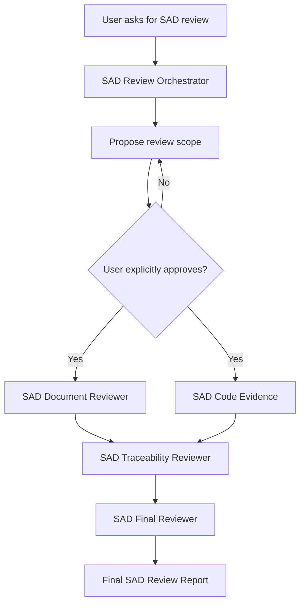

# BOS SAD Review

Local Codex workspace for evidence-first review of the UMD/KMD Software Architecture Design.

## Inputs

```text
review-input/
├── sad/
│   └── umd-kmd-sad.md
├── checklist/
│   └── sad-review-checklist.md
└── guideline/
    ├── sad-writing-guideline.md
    └── assets/
```

## Implementation Evidence

```text
source/
├── bos-umd/
└── bos-kmd/
```

The source repositories are evidence only. They are not the authority for intended architecture.

## Review Workflow



The workflow is intentionally gated. No actual review findings are produced before scope approval.

## Codex Skills

- `sad-review-orchestrator` — prepare and enforce the approved review scope, then coordinate the workflow.
- `sad-document-reviewer` — inspect SAD content against the checklist and writing guideline without using code as design truth.
- `sad-code-evidence` — collect UMD/KMD implementation evidence without making architecture compliance decisions.
- `sad-traceability-reviewer` — map requirements, SAD elements, interfaces, flows, and implementation evidence when available.
- `sad-final-reviewer` — apply the controlled criteria to the evidence package and produce findings plus the final report.

## Start a Review

Open the repository in VSCode/Codex and use a prompt such as:

```text
Review the UMD/KMD SAD in this workspace.
Follow AGENTS.md and use the sad-review-orchestrator workflow.
First propose the effective review scope and wait for my explicit approval.
Do not produce findings before I approve the scope.
```

After Codex proposes the scope, explicitly reply with approval if it is correct, for example:

```text
Approved. Use exactly this scope.
```

## Outputs

```text
review/
├── scope.md
├── evidence/
│   ├── document-evidence.md
│   ├── umd-code-evidence.md
│   ├── kmd-code-evidence.md
│   └── traceability.md
├── findings/
│   └── findings.md
└── reports/
    └── sad-review-report.md
```

## Adding SRS Later

Place controlled requirement exports under:

```text
review-input/srs/
├── umd-srs.md
└── kmd-srs.md
```

Then add those files to the proposed scope before approving the review. The traceability step can extend to:

```text
SRS / VC -> SAD element -> interface / flow -> implementation evidence
```
