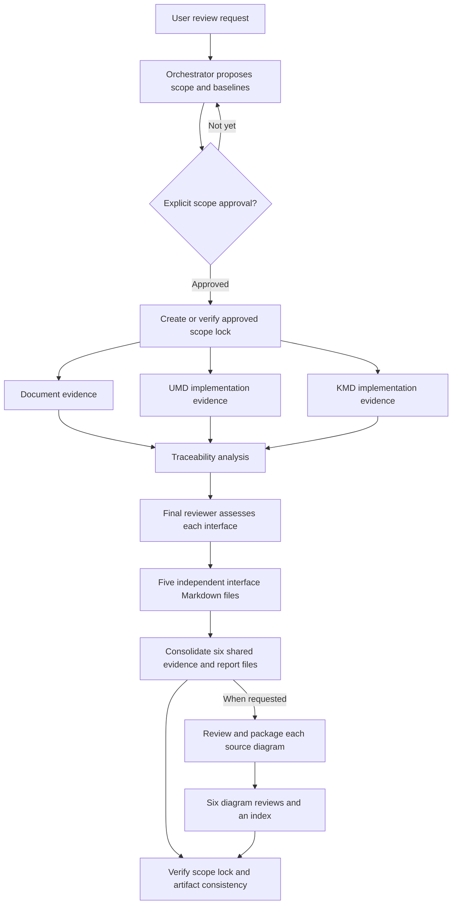

# Input Prompts and Agent Architecture

This workspace supports an evidence-based review of the BOS UMD/KMD Software Architecture Design (SAD). It provides two related workflows: a full SAD review with independent interface assessments, and a review of every preserved architecture diagram.

This README explains the input prompts, agent responsibilities, handoffs and Markdown outputs. It is workflow documentation; it does not change [AGENTS.md](AGENTS.md), the controlled checklist/guideline, or the [approved review scope](review/scope.md).

Start with the [full SAD report](review/reports/sad-review-report.md) for existing results, or the [diagram review index](review/diagram/README.md) for all six diagram reviews. Use the resume prompt below when continuing the approved review.

## Workspace and inputs

| Location | Purpose | Review access |
|---|---|---|
| [AGENTS.md](AGENTS.md) | Workspace rules, source authority and formal-finding gate | Read and follow |
| [Target SAD](review-input/sad/umd-kmd-sad.md) | Architecture being reviewed | Read-only |
| [SAD Review Checklist](review-input/checklist/sad-review-checklist.md) | Controlled SAD-01 through SAD-09 questions | Read-only |
| [SAD Writing Guideline](review-input/guideline/sad-writing-guideline.md) | Controlled architecture/documentation criteria | Read-only |
| `source/bos-umd/` | UMD implementation at the approved branch/commit | Read-only implementation evidence |
| `source/bos-kmd/` | KMD implementation at the approved branch/commit | Read-only implementation evidence |
| `.codex/skills/` | Five local SAD review workflows | Read and apply relevant skills |
| `review/` | Scope, lock, evidence, interface/diagram reviews, findings and report | Write authorized review artifacts |

A controlled SRS is not currently supplied. Preserved Mermaid, PlantUML or image diagrams are evidence when included in the approved inputs; missing assets are not reconstructed. External links in the SAD or guideline do not automatically become approved evidence.

The exact current document hashes, repository branches and full commits are recorded in [scope.lock](review/scope.lock). A branch name alone is not a reproducible baseline, and a checked-in build default does not establish intended or deployed configuration.

## Agent architecture

The roles below correspond to the five local skills. They describe responsibilities and decision authority, not five persistent services or an automatic background runner. One agent can execute distinct skill phases; where delegation is available, workers can handle separate evidence tasks or interface files within the same approved scope.

| Role / skill | Inputs and responsibility | Handoff / decision boundary |
|---|---|---|
| [SAD review orchestrator](.codex/skills/sad-review-orchestrator/SKILL.md) | Read workspace rules; prepare scope; record baselines; enforce approval and lock; coordinate work | Provides the approved task boundaries and coordinates artifacts. Final compliance judgment belongs to the final-review phase. |
| [SAD document reviewer](.codex/skills/sad-document-reviewer/SKILL.md) | Read approved SAD, checklist and guideline, including preserved diagrams | Produces controlled-rule and document evidence. Does not substitute source code for intended design or assign final checklist outcomes. |
| [SAD code evidence](.codex/skills/sad-code-evidence/SKILL.md) — UMD assignment | Inspect the approved `bos-umd` baseline for relevant APIs, call flows, setup, data access and lifetime | Produces UMD observations with file, symbol and line references; identifies drift candidates without selecting intended behavior. |
| [SAD code evidence](.codex/skills/sad-code-evidence/SKILL.md) — KMD assignment | Inspect the approved `bos-kmd` baseline for kernel interfaces, mappings, ownership and lifetime | Produces separate KMD observations and limits. This is a second assignment of the same skill, not another installed skill. |
| [SAD traceability reviewer](.codex/skills/sad-traceability-reviewer/SKILL.md) | Combine document evidence, UMD/KMD evidence and controlled requirements when supplied | Maps both requirement directions and SAD-to-code correspondence. Records gaps/conflicts/blocked dependencies without inventing requirements. |
| [SAD final reviewer](.codex/skills/sad-final-reviewer/SKILL.md) | Apply controlled criteria to the evidence and traceability package | Owns checklist outcomes, finding classification and justified severity; completes independent interface assessments and final reporting. |



Independent document and repository evidence tasks can run in parallel after approval. Traceability depends on that evidence, and final judgments depend on both. If several workers participate, give each its approved input subset, exact baselines, output ownership and decision limits. Assign one writer per file and a designated consolidator for shared evidence, the finding index and report.

For this review, the user explicitly required the publication order **lock and verify → finish all five interface files → generate the six shared artifacts**. Evidence and traceability are collected before each interface verdict; their final shared ledgers are consolidated afterward. This output order overrides the skills' default timing for writing their shared outputs.

## Review controls

Use the authority order in AGENTS.md: approved user scope, controlled checklist, controlled guideline, supplied controlled requirements, target architecture, pinned implementation evidence, then clearly labeled reviewer observations. Report conflicts rather than silently choosing an authority.

Keep these evidence classes distinguishable:

| Evidence class | Meaning |
|---|---|
| `CONTROLLED RULE` | An applicable checklist or guideline obligation |
| `DOCUMENT FACT` | What the supplied SAD or other approved document actually states |
| `IMPLEMENTATION EVIDENCE` | What the pinned source demonstrates within the inspected paths |
| `ASSUMPTION` | An unverified premise, never a substitute for required evidence |
| `REVIEW OBSERVATION` | Engineering commentary that is not a proved controlled-rule violation |
| `OPEN ISSUE` | Missing evidence or a decision requiring an owner |

A formal finding needs a specific applicable rule, available target evidence and a directly demonstrated gap or contradiction, without an invented requirement. Otherwise use the appropriate observation, drift, missing-evidence or decision classification. Every formal record should identify the rule, location, evidence, issue, impact, suggested correction and traceability; use the [finding format](.codex/skills/sad-final-reviewer/references/finding-format.md).

The current approved scope also requires:

- Normal checklist results are `Pass`, `Fail` or `N/A`, with reasons for Fail/N/A. **SAD-04 is Blocked when the controlled SRS is unavailable**, under the user's explicit override; state the dependency.
- **SAD-09 must not automatically Fail** because external PM/planning evidence is outside the supplied scope. Assess applicability and available evidence; scope-qualified N/A needs a reason and does not mean no planning impact.
- Source is implementation evidence only. Do not infer stakeholder intent, invent missing behavior or automatically choose code over the SAD when they differ.
- Review UMD and KMD separately, their shared boundary, and consistency across Overview, Static View, Interface Description and Dynamic View.
- Keep all five detailed interface assessments in separate files. A shared issue may be applied where justified, but is counted once in the aggregate index.
- Keep protected inputs/source unchanged. No builds, runtime/hardware tests, deployment, external publication, tickets or messages are included in the current review scope.

## Input prompt 1 — Propose a new review scope

Use this for a new review or a deliberate scope revision. For the already approved baseline, use the resume prompt instead.

```text
Review the SAD in this workspace.
Follow AGENTS.md and the SAD review skills under .codex/skills/.

Target SAD:
- review-input/sad/umd-kmd-sad.md

Controlled review inputs:
- review-input/checklist/sad-review-checklist.md
- review-input/guideline/sad-writing-guideline.md

Implementation evidence:
- source/bos-umd
- source/bos-kmd

Mode: Full SAD review plus SAD-to-implementation alignment.
Coverage: SAD-01 through SAD-09, all five interfaces, UMD/KMD boundaries,
all preserved diagrams, and consistency across the document's views.
No controlled SRS is supplied unless explicitly listed in the scope.

Keep controlled inputs and source repositories read-only.
Treat code only as implementation evidence; do not invent intended behavior.
Use Blocked for SAD-04 when controlled SRS evidence is unavailable.
Do not automatically Fail SAD-09 for out-of-scope PM/planning evidence.
Require one independent Markdown review per interface under review/interfaces/.
Include scope locking and the canonical shared evidence/findings/report outputs
in the proposed scope.

Before actual analysis:
1. Read AGENTS.md and relevant skill instructions.
2. Inspect only enough input/repository metadata to define the scope.
3. Record the SAD revision, controlled-input hashes, and each repository's
   branch, full commit and worktree state. Do not fetch or change baselines.
4. Prepare review/scope.md, preserving any prior approval provenance.
5. Show the exact effective scope, exclusions, missing evidence and outputs.
6. STOP and wait for explicit approval.

Do not produce findings, checklist results or interface review files before
approval. Do not replace an existing approved lock while preparing a proposal.
```

## Input prompt 2 — Approve, lock and execute

Send this only after reviewing the proposed scope. The approval applies to that concrete proposal; it is not permission to add unspecified requirements or baselines.

```text
Approved. Lock exactly the scope you just proposed.

Create review/scope.lock and verify it before starting analysis. Record the
approved scope hash, controlled-input hashes, repository branches/full commits,
worktree state and authorized outputs. Do not silently refresh a mismatched lock.

Review each interface independently and complete:
- review/interfaces/01-cluster.md
- review/interfaces/02-device-memory-access.md
- review/interfaces/03-device-register-access.md
- review/interfaces/04-multicast-write.md
- review/interfaces/05-tlb-configuration.md

Each file must contain interface scope, SAD contract, separate UMD and KMD
implementation evidence, traceability, the complete SAD-01 through SAD-09
checklist with results and reasons for Fail/N/A/Blocked, findings, decisions
required, coverage limits and a final interface result.

Collect document/code evidence and traceability before final judgments.
After all five interface reviews are complete, generate:
- review/evidence/document-evidence.md
- review/evidence/umd-code-evidence.md
- review/evidence/kmd-code-evidence.md
- review/evidence/traceability.md
- review/findings/findings.md
- review/reports/sad-review-report.md

Apply the approved SAD-04 Blocked and SAD-09 applicability rules.
Use formal findings only when the controlled-rule/direct-evidence gate is met.
Keep detailed interface reviews separate and deduplicate shared findings.
Verify the scope lock and artifact consistency at completion.
Do not expand the approved scope without asking me first.
```

## Input prompt 3 — Resume the approved review

Use this when the scope is already approved and the task has been interrupted. Existing authorization remains valid for unchanged work.

```text
Continue the approved SAD review in this workspace.
Read AGENTS.md, review/scope.md, review/scope.lock and the saved review artifacts.
Verify the locked input hashes, repository branches/commits and worktree state.

Resume unfinished work from the existing evidence and outputs. Reuse verified
work and preserve finding IDs; do not restart completed analysis or request
scope approval again when the approved scope is unchanged.

Keep the five interface reviews separate. Complete any missing shared outputs
in the approved order, then validate links, evidence references, checklist
coverage, finding consistency and the scope lock.

If an input, baseline, criterion or exclusion has changed, stop affected work
and identify the mismatch. Do not silently replace the lock or use new evidence.
```

## Input prompt 4 — Review all diagrams

Use this after scope approval, or request diagram outputs in the initial proposal. The current SAD contains one static graph and five sequence diagrams. This prompt explicitly authorizes the supplemental output directory.

```text
Review every diagram in review-input/sad/umd-kmd-sad.md using the approved
scope, controlled checklist/guideline and pinned UMD/KMD evidence.
Follow AGENTS.md and the SAD review skills. Verify the existing scope lock first.

Write Markdown outputs only under review/diagram/:
- README.md
- 00-static-view.md
- 01-cluster-construction.md
- 02-device-memory-access.md
- 03-device-register-access.md
- 04-multicast-write.md
- 05-tlb-configuration.md

Keep each detailed diagram review separate. Each must include:
- Source location and the exact original Mermaid diagram, without redesign.
- Scope/baselines and applicable controlled rules.
- Document facts, positive support and consistency across the SAD's views.
- Separate UMD and KMD implementation evidence with source references.
- Findings, implementation drift, observations or missing evidence, clearly classified.
- Decisions required, traceability limitations and a final diagram assessment.

Reuse existing finding IDs for already recorded issues; do not count repeated
presentations as new defects. Link the full interface checklists rather than
mechanically assigning every SAD criterion to each drawing.

Do not automatically fail a diagram because an Activity Diagram is absent or
because a userspace getter has no KMD participant. Apply the actual guideline
and scenario applicability. Do not infer missing architecture from code.

Create an index covering all diagrams. Verify the copied Mermaid text,
references and baselines. Keep the SAD, controlled rules, source repositories
and original scope lock unchanged; record this supplemental output authorization
in the diagram index. Ask before changing controlled review scope.
```

To focus on a subset without changing approved inputs, use:

```text
Recheck the five Dynamic View diagrams within the approved scope.
Explain the document gaps separately from UMD/KMD implementation drift.
Update the authorized review Markdown where evidence warrants a correction,
preserving independent interface files and consistent finding IDs/results.
Do not rewrite the SAD or invent replacement sequences.
```

## Output structure

```text
review/
├── scope.md
├── scope.lock
├── interfaces/
│   ├── 01-cluster.md
│   ├── 02-device-memory-access.md
│   ├── 03-device-register-access.md
│   ├── 04-multicast-write.md
│   └── 05-tlb-configuration.md
├── evidence/
│   ├── document-evidence.md
│   ├── umd-code-evidence.md
│   ├── kmd-code-evidence.md
│   └── traceability.md
├── findings/
│   └── findings.md
├── reports/
│   └── sad-review-report.md
└── diagram/
    ├── README.md
    ├── 00-static-view.md
    ├── 01-cluster-construction.md
    ├── 02-device-memory-access.md
    ├── 03-device-register-access.md
    ├── 04-multicast-write.md
    └── 05-tlb-configuration.md
```

| Artifact group | Responsibility |
|---|---|
| [Scope](review/scope.md) and [lock](review/scope.lock) | Define the approved inputs, baselines, rules, exclusions and original output authorization. Verify before analysis and at completion. |
| Independent interface files | Each includes its full contract/evidence, all nine checklist questions, findings, decisions and final result. |
| [Document evidence](review/evidence/document-evidence.md) | One evidence section per controlled criterion, separating rule, fact, gap and unresolved applicability. |
| [UMD evidence](review/evidence/umd-code-evidence.md) / [KMD evidence](review/evidence/kmd-code-evidence.md) | Keep repository observations, source references and limitations distinguishable. |
| [Traceability](review/evidence/traceability.md) | Requirement → architecture → implementation and architecture → justifying requirement when supplied; supporting SAD-to-code mappings otherwise. |
| [Findings](review/findings/findings.md) | Unique finding index and shared records, linked to detailed interface records. |
| [Report](review/reports/sad-review-report.md) | Overall results, coverage, boundary assessment, decisions and completion checks. |
| [Diagram package](review/diagram/README.md) | One review per original diagram plus an inventory/index; supplements the full interface assessments. |

The existing diagram package was requested after the original review approval. Its seven supplemental files are authorized by that later user request and documented in its index. The original lock intentionally retains the earlier output list; supplemental packaging does not silently alter controlled inputs, criteria or repository baselines.

## Adding controlled requirements or changing scope

A later SRS can be supplied under a clearly identified location such as `review-input/srs/`. The presence of a file alone does not authorize its use. Name the exact controlled files, revisions and proposed coverage, then obtain approval before requirement analysis or use of a changed implementation baseline.

```text
Prepare a scope revision to include the controlled requirements files I supply.
Identify their exact paths, revisions and hashes, and explain which previously
Blocked traceability checks can be performed. Preserve the prior scope/lock
provenance and completed review records.

Show the proposed revised scope and STOP for approval before analyzing the new
requirements or replacing the active lock. Do not treat source as requirements.
```

## Completion checks

A completed review should show approved scope and matching baselines; all required independent outputs; evidence-backed findings; explicit UMD/KMD boundary assessment; traceability to the extent controlled inputs permit; and clear missing-evidence/coverage limitations. Check source locations, local links, finding/evidence IDs, checklist completeness and consistency between detailed files and the aggregate report. Diagram packaging additionally checks that every reviewed original diagram is covered and preserved exactly.

Completion of the scoped review does not mean the SAD passed, blocked requirements were satisfied, runtime behavior was tested, or stakeholder approval was obtained. Findings and open decisions remain visible in their review artifacts.
