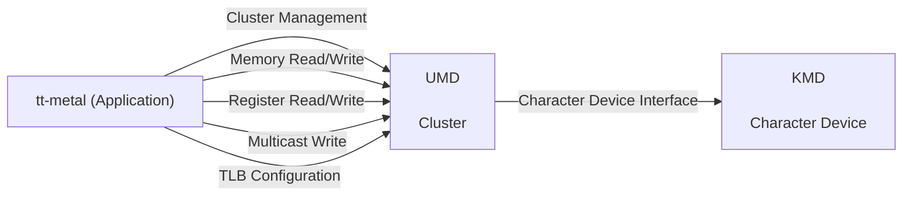
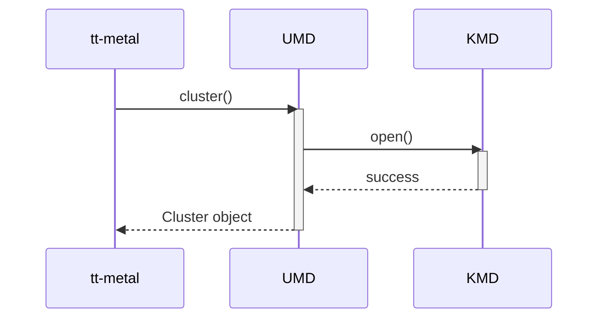
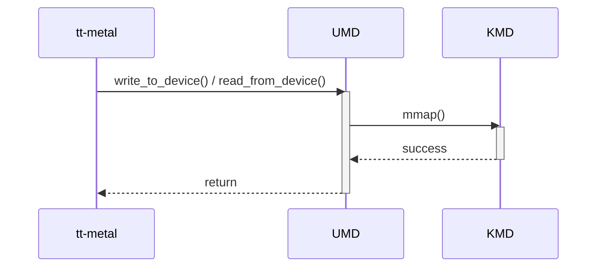
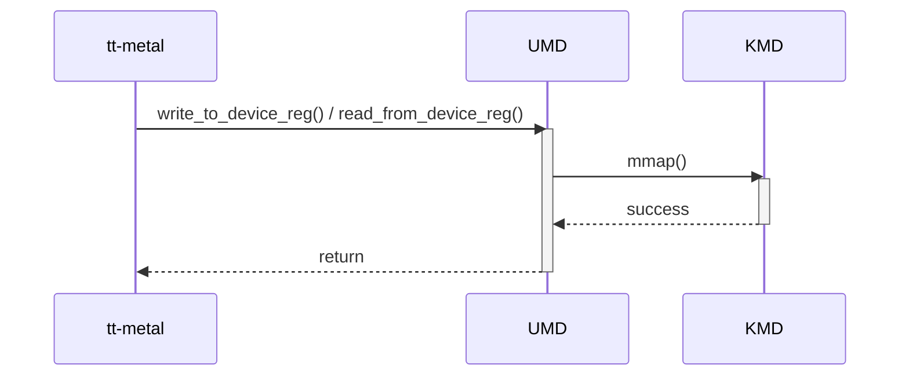
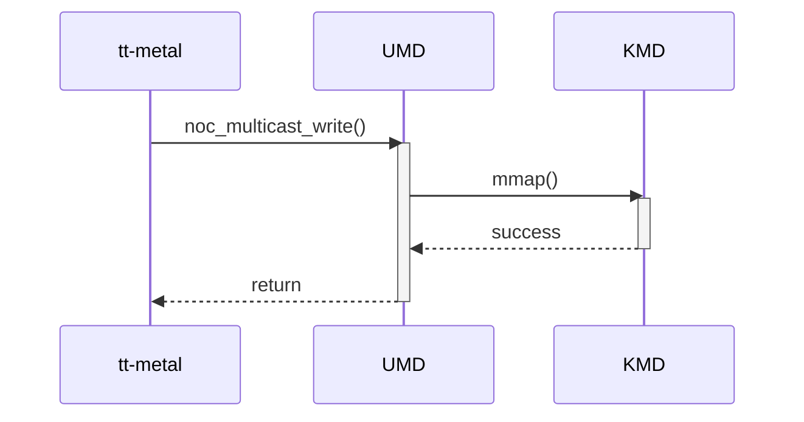
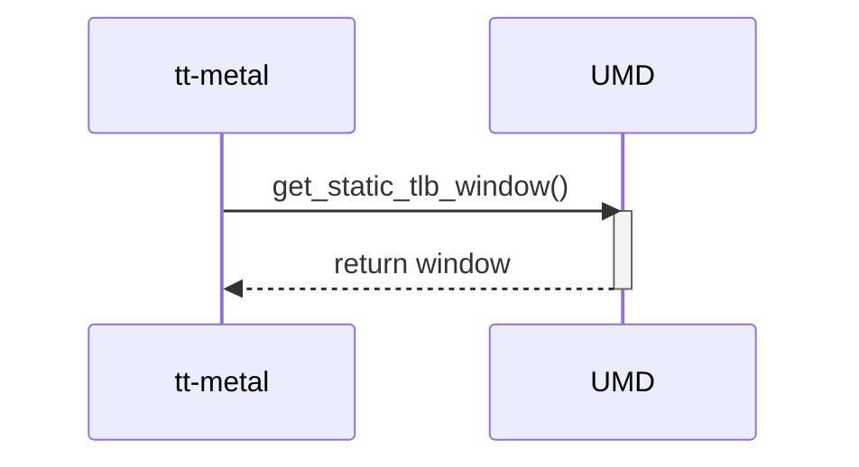

# [ SAD ] UMD / KMD

## Revision History

| Revision | When | What | Who |
|---|---|---|---|
| 0.1 | Sep 15, 2026 | Initial Version | @Hailee Kim(김승하) , @MyeongGI Jeong |
|  |  |  |  |
|  |  |  |  |

## Basic information

- Related ticket: [NSDT-1954: [HS] UMD/KMD SAD Write](https://bos-semi.atlassian.net/browse/NSDT-1954) — In Progress
- SAD writing guideline: [SAD Writing Guideline](https://bos-semi.atlassian.net/wiki/spaces/SE/pages/546996303)
- Source repository: To be updated
- Reference hash: To be updated

---

## Overview

|  |  |
|---|---|
| SWC ID |  |
| Name | SWC UMD |
| Description | UMD provides functionality for chip cluster creation and initialization, topology discovery, and memory and register access.  UMD abstracts chip- and architecture-specific details and provides PCIe-based access to silicon devices. In PCIe silicon environments, UMD communicates with the hardware through device nodes, ioctl interfaces, and BAR memory mappings provided by the Kernel Mode Driver (KMD). |
| Provided interface | Cluster Management  Device Access API  Memory and Register Access API  Topology Discovery API  Architecture Description API |
| Required interface | Kernel Mode Driver Interface  Host PCIe Interface  NPU Accelerator Hardware Interface |
| Global Variables | N/A |

## Static View

### Diagram

### Interface description

| Interface Name | Cluster() |
|---|---|
| Description | This interface provides cluster creation and initialization for the accelerator devices detected on the host system. |
| Input | None |
| Output |  |

| Type | Name | Description | Default value | Range | Unit |
|---|---|---|---|---|---|
| Cluster | object | Constructors do not return a value. A Cluster instance is created as the result of construction. | - | - | - |

| Limitation / Constraint | - |
|---|---|

| Interface Name | Device Memory Access Interface |
|---|---|
| Operations | write_to_device() , read_from_device() |
| Description | This interface provides read and write access to device memory for a specified target core and device address. |
| Input | write_to_device() |

| Type | Name | Description | Default value | Range | Unit |
|---|---|---|---|---|---|
| CoreCoord | core | Target core coordinate | - | Valid core | - |
| const void* | src | Source buffer containing data to be written | - | - | - |
| uint64_t | address | Destination device memory address | - | Valid memory region | Byte |
| size_t | size | Size of data to write | - | >0 | Byte |

**read_from_device()**

| Type | Name | Description | Default value | Range | Unit |
|---|---|---|---|---|---|
| CoreCoord | core | Target core coordinate | - | Valid core | - |
| uint64_t | address | Source device memory address. | - | Valid memory region | Byte |
| size_t | size | Size of data to write | - | >0 | Byte |

| Output | write_to_device() |
|---|---|

| Type | Name | Description | Default value | Range | Unit |
|---|---|---|---|---|---|
| void | - | No return value | - | - | - |

**read_from_device()**

| Type | Name | Description | Default value | Range | Unit |
|---|---|---|---|---|---|
| void* | dest | Host buffer containing the data read from the device. | - | - | - |

| Limitation / Constraint | The target core and device address shall be valid and accessible for the selected device. |
|---|---|

| Interface Name | Device Register Access Interface |
|---|---|
| Operations | write_to_device_reg() , read_from_device_reg() |
| Description | This interface provides read and write access to device registers for a specified target core and register address. |
| Input | write_to_device_reg() |

| Type | Name | Description | Default value | Range | Unit |
|---|---|---|---|---|---|
| CoreCoord | core | Target core coordinate | - | Valid core | - |
| const void* | src | Source buffer containing data to be written | - | - | - |
| uint64_t | address | Destination device memory address | - | Valid memory region | Byte |
| size_t | size | Size of data to write | - | >0 | Byte |

**read_from_device_reg()**

| Type | Name | Description | Default value | Range | Unit |
|---|---|---|---|---|---|
| CoreCoord | core | Target core coordinate | - | Valid core | - |
| uint64_t | address | Source register address. | - | Valid register region | Byte |
| size_t | size | Size of data to write | - | >0 | Byte |

| Output | write_to_device() |
|---|---|

| Type | Name | Description | Default value | Range | Unit |
|---|---|---|---|---|---|
| void | - | No return value | - | - | - |

**read_from_device()**

| Type | Name | Description | Default value | Range | Unit |
|---|---|---|---|---|---|
| void* | dest | Host buffer containing the register value read from the device. | - | - | - |

| Limitation / Constraint | The target register address shall be valid and accessible for the selected core. |
|---|---|

| Interface Name | Multicast Write |
|---|---|
| Operations | noc_multicast_write() |
| Description | Performs a NoC multicast write to multiple destination cores within the specified multicast region. |
| Input |  |

| Type | Name | Description | Default value | Range | Unit |
|---|---|---|---|---|---|
| const void* | src | Source buffer containing data to be multicast. | - | Valid core | - |
| destination set / range | dest | Specifies the multicast destination cores or multicast region. | - | Valid NoC targets | - |
| uint64_t | address | Destination device memory address | - | Valid device address | Byte |
| size_t | size | Size of data to write | - | >0 | Byte |

| Output | write_to_device() |
|---|---|

| Type | Name | Description | Default value | Range | Unit |
|---|---|---|---|---|---|
| void | - | No return value | - | - | - |

| Limitation / Constraint | The multicast destination region and target address shall be valid for the target architecture. |
|---|---|

| Interface Name | TLB Configuration |
|---|---|
| Operations | get_static_tlb_window() |
| Description | Retrieves the static TLB window associated with the specified device address or TLB configuration. The returned window is used for PCIe BAR-based device access. |
| Input |  |

| Type | Name | Description | Default value | Range | Unit |
|---|---|---|---|---|---|
| Device Address/ TLB Identifier | target | Identifies the target device address or static TLB entry for which the window is requested. | - | Valid static TLB region | - |

| Output | write_to_device() |
|---|---|

| Type | Name | Description | Default value | Range | Unit |
|---|---|---|---|---|---|
| TLB Window | window | Static TLB window information used to access the corresponding device address range. | - | Valid mapped window | - |

| Limitation / Constraint | A valid static TLB mapping shall exist for the requested device address or TLB index. |
|---|---|

## Dynamic View

### Diagram

#### Cluster Construction

#### Device Memory Write/Read

#### Device Register Write/Read

#### Multicast Write

#### TLB Configuration

