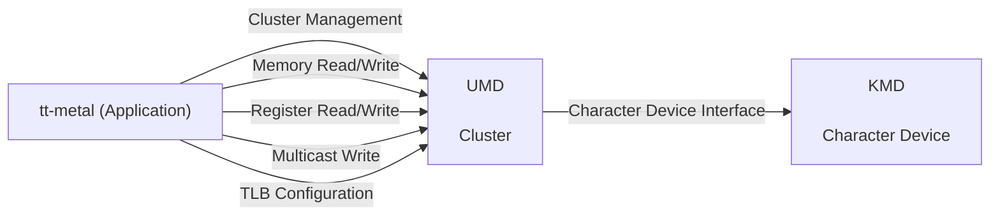

# Static View Diagram Review

**Diagram assessment: Fail for the assessed component-definition coverage (existing SAD-F-001, Major).** The diagram does identify separate UMD and KMD nodes and their dependency. The failure concerns the missing component responsibilities/design scopes in the accompanying architecture, not an absent KMD node.

## Scope and provenance

- Review date: 2026-10-08 (Asia/Ho_Chi_Minh).
- Target: [umd-kmd-sad.md](/home/hoangb/BOS/sad-review/review-input/sad/umd-kmd-sad.md:35), revision 0.1, September 15, 2026; Static View diagram, lines 35–48, read with Overview, interface descriptions and all five Dynamic Views.
- Controlled criteria: [SAD Review Checklist](/home/hoangb/BOS/sad-review/review-input/checklist/sad-review-checklist.md:15) and [SAD Writing Guideline](/home/hoangb/BOS/sad-review/review-input/guideline/sad-writing-guideline.md:109), at the hashes in the [scope lock](../scope.lock).
- UMD: `source/bos-umd`, `develop @ 86e0ab17209d7af8f741ac34c158ebbf71612ea4`.
- KMD: `source/bos-kmd`, `develop @ 12d235aeedb8aa55ede24927c9e09f88c8f278c4`.
- This is the user-requested supplemental diagram output under `review/diagram/`. Inputs, implementation baselines, review criteria and exclusions remain those of the [approved scope](../scope.md). The original scope/lock and canonical findings are not amended by this output.
- [Diagram review index](README.md). Detailed independent interface reviews remain the authoritative location for all nine checklist outcomes.

## Original diagram

The following is copied verbatim from the controlled SAD, including its original labels. It is evidence, not a proposed replacement.

## Applicable controlled rules

| Criterion | Controlled rule and source | Application here |
|---|---|---|
| SAD-01 | [Checklist:17](/home/hoangb/BOS/sad-review/review-input/checklist/sad-review-checklist.md:17): components, responsibilities, boundaries, relationships and external/reused elements must be clear. | Assess the UMD/KMD component model with its accompanying text. |
| Software-level static view | [Guideline:122–135](/home/hoangb/BOS/sad-review/review-input/guideline/sad-writing-guideline.md:122): identify major components, responsibilities, connections, interface labels, and each component's functionality/design scope. | Distinct named nodes and labeled arrows supply structural evidence; they do not replace component descriptions. |
| Design scope and black-box treatment | [Guideline:146–151](/home/hoangb/BOS/sad-review/review-input/guideline/sad-writing-guideline.md:146): black-box treatment is conditional on the identified design scope, and retains external-contract obligations. | The review cannot assume that KMD is a black box merely because internals are absent. |
| Applicable component-level detail | [Guideline:174–198](/home/hoangb/BOS/sad-review/review-input/guideline/sad-writing-guideline.md:174): component summary, provided/required interfaces and applicable internal decomposition. | The SAD's sole UMD overview does not settle the separate KMD scope or the level of internal detail expected. No source-file layout is prescribed. |
| SAD-02 | [Checklist:18](/home/hoangb/BOS/sad-review/review-input/checklist/sad-review-checklist.md:18) and [Guideline:155](/home/hoangb/BOS/sad-review/review-input/guideline/sad-writing-guideline.md:155): external interface purpose, I/O, method and direction. | Check what the Character Device Interface edge establishes and what must be supplied by its contract. Not every parameter has to appear on the drawing. |
| SAD-05 | [Checklist:21](/home/hoangb/BOS/sad-review/review-input/checklist/sad-review-checklist.md:21): internal consistency across views, plus consistency with controlled requirements. | Compare the static model with Overview, tables and sequences. Requirement semantics remain unassessed because no controlled SRS is supplied. |

These are the criteria directly relevant to this diagram. They are not a new complete SAD-01–SAD-09 checklist for one drawing. Shared analysis, feasibility, reuse and planning outcomes remain in the independent reviews and [final report](../reports/sad-review-report.md).

## Document facts and positive support

`DOCUMENT FACT` — The graph explicitly contains three nodes: `tt-metal (Application)`, `UMD / Cluster`, and `KMD / Character Device`. UMD and KMD are therefore modeled as separate participants, with a directed `Character Device Interface` dependency. The five application-to-UMD edges name Cluster Management, Memory Read/Write, Register Read/Write, Multicast Write and TLB Configuration.

`DOCUMENT FACT` — The [Overview:24–29](/home/hoangb/BOS/sad-review/review-input/sad/umd-kmd-sad.md:24) identifies only `SWC UMD`; its SWC ID is blank. It describes UMD's cluster/topology/access role and KMD-provided device nodes, ioctl interfaces and BAR mappings. No corresponding KMD component summary or Design Scope/black-box designation appears in the complete 269-line SAD. These facts support an incomplete specification finding while preserving the positive evidence that the diagram separates the nodes.

`REVIEW OBSERVATION` — The graph is useful as a high-level dependency summary. A one-way application-call/dependency arrow does not, by itself, assert that read data flows only toward UMD. No reverse arrow, additional hardware node, every source method, or mandatory internal module name is invented as a requirement. The intended level of detail must be resolved through the controlled component design scope.

## Consistency across the document's views

| Comparison | Direct evidence | Assessment and limit |
|---|---|---|
| Overview → static components | Overview names UMD's KMD dependency at SAD:26–28; static graph names separate UMD and KMD at 38–39 and connects them at 47. | Broad dependency is consistent. Separate component specifications remain incomplete. |
| Static edge categories → interface descriptions | Cluster at SAD:52–63; memory at 65–100; registers at 102–137; multicast at 139–160; TLB at 162–180. | Every one of the five application edges has a corresponding interface table. This is category-level coverage, not proof that each contract is complete. |
| Static categories → dynamic participants | Cluster/memory/register/multicast sequences use TT, UMD and KMD (SAD:186–256); TLB retrieval uses TT and UMD (258–269). | Participant identities broadly agree. A static KMD dependency does not require a kernel call during every UMD operation. TLB's userspace-only sequence is not a contradiction by itself. |
| Static KMD edge → dynamic operation | `Character Device Interface` is instantiated as `open()` for Cluster and `mmap()` for memory/register/multicast. | Communication mechanism is partly visible. Mapping ownership/lifetime and the meaning of access completion are still not controlled boundary contracts. Existing dynamic findings remain in their own diagram/interface reviews. |
| Overview breadth → static labels | SAD:27 also names Topology Discovery API and Architecture Description API; SAD:28 names Host PCIe and NPU Accelerator Hardware interfaces. | Their exact relationship to the graph's broad categories is unestablished. This is a review observation supporting clarification of SAD-F-001, not a new defect requiring a separate edge for every named API or a hardware node. |
| TLB category → TLB operation | The graph says `TLB Configuration`; SAD:164–165 and the sequence at 265 describe `get_static_tlb_window()` retrieval. | Existing **TLB-TERM** terminology/scope observation. Retrieval need not reconfigure hardware; intended grouping needs an owner decision. |

Local table naming errors and exact API drift are retained in the relevant interface files. They are not counted again as new static-diagram findings.

## UMD implementation evidence

All rows are `IMPLEMENTATION EVIDENCE` at the pinned UMD commit; none supplies intended component architecture.

| Evidence | Source and symbols | Observed support for the static model | Limit |
|---|---|---|---|
| UMD-EV-003 | [cluster.h:29–82](/home/hoangb/BOS/sad-review/source/bos-umd/device/blackholeplus/cluster.h:29); [cluster.cpp:265–334](/home/hoangb/BOS/sad-review/source/bos-umd/device/blackholeplus/cluster.cpp:265); `ClusterOptions`, `Cluster::Cluster`. | A userspace Cluster abstraction selects/constructs chips from configuration and descriptors. The defaulted constructor can be called without arguments. | Its class layout/options are not proof of the intended SWC decomposition or full topology scope. |
| UMD-EV-004 | [pci_device.cpp:170–324](/home/hoangb/BOS/sad-review/source/bos-umd/device/blackholeplus/pci_device.cpp:170); `PCIDevice` constructor/destructor. | Opens `/dev/bos/N`, queries mapping descriptors, stores BAR0/BAR2/BAR4 mappings, and later releases resources. Supports a real UMD→KMD setup/lifetime dependency. | Does not mean every UMD payload operation is a syscall or establish intended ownership/recovery policy. |
| UMD-EV-005/006/007 | [cluster.h:271–316](/home/hoangb/BOS/sad-review/source/bos-umd/device/blackholeplus/cluster.h:271); [local_chip.cpp:177–205](/home/hoangb/BOS/sad-review/source/bos-umd/device/blackholeplus/local_chip.cpp:177) and [266–310](/home/hoangb/BOS/sad-review/source/bos-umd/device/blackholeplus/local_chip.cpp:266); memory/register dispatch. | Named memory/register methods and their payload paths support the graph's two access categories. | Detailed signature and mapping-sequence differences remain existing drift records; category support is not exact API or behavioral equivalence. |
| UMD-EV-008/009 | [UMD ledger](../evidence/umd-code-evidence.md); tracked C/C++ search; nearby `broadcast_write_to_cluster` and `get_static_tlb_writer`. | Nearby source facilities provide comparison context for multicast and static-window categories. | The exact SAD names `noc_multicast_write` and `get_static_tlb_window` were not found in the recorded search. Nearby methods are not confirmed bindings. |
| UMD-EV-013 | [device/ioctl.h:16–83](/home/hoangb/BOS/sad-review/source/bos-umd/device/ioctl.h:16); paired device-info/mapping definitions. | Used ioctl identifiers and queried layouts/mapping IDs match the inspected KMD counterpart statically. | This is bounded boundary support, not a full ABI/deployment compatibility claim. |

The code review follows the recorded Blackholeplus/BOS selection; [UMD-EV-001](../evidence/umd-code-evidence.md) documents the checked-in default. A default is not evidence of the intended or deployed variant.

## KMD implementation evidence

All rows are `IMPLEMENTATION EVIDENCE` at the pinned KMD commit and kept separate from UMD evidence.

| Evidence | Source and symbols | Observed support for the static model | Limit |
|---|---|---|---|
| KMD-EV-002 | [enumerate.c:48–147](/home/hoangb/BOS/sad-review/source/bos-kmd/enumerate.c:48); [chardev.c:81–104](/home/hoangb/BOS/sad-review/source/bos-kmd/chardev.c:81); PCI probe and devnode registration. | Per-device character nodes named `bos/N` support the Character Device node. | Kernel device ordinal and UMD logical chip identity are distinct; this is not a kernel Cluster object or complete topology model. |
| KMD-EV-003 | [chardev.c:36–42](/home/hoangb/BOS/sad-review/source/bos-kmd/chardev.c:36); `chardev_fops`. | Provides `open`, `release`, `ioctl` and `mmap`; no ordinary file `read`/`write` payload callbacks are registered. | A Character Device dependency does not establish kernel execution for every application read/write. |
| KMD-EV-004/005 | [memory.c:372–449](/home/hoangb/BOS/sad-review/source/bos-kmd/memory.c:372), `ioctl_query_mappings`; [chardev.c:403–408](/home/hoangb/BOS/sad-review/source/bos-kmd/chardev.c:403), `tt_cdev_mmap`; [memory.c:1186–1237](/home/hoangb/BOS/sad-review/source/bos-kmd/memory.c:1186), `bos_mmap`. | Exposes mapping descriptors and establishes BAR/TLB/DMA mappings through the character-device boundary. | Mapping establishment is distinct from application payload movement and does not provide the absent SAD contract. |
| KMD-EV-010 | [chardev.c:431–499](/home/hoangb/BOS/sad-review/source/bos-kmd/chardev.c:431), `tt_cdev_open`/`tt_cdev_release`; [enumerate.c:150–178](/home/hoangb/BOS/sad-review/source/bos-kmd/enumerate.c:150), removal. | File/device references and cleanup show kernel resource lifetimes separate from a userspace Cluster object. | Does not prove intended reset, removal, concurrent-use or failure-recovery guarantees. |

The [KMD ledger](../evidence/kmd-code-evidence.md) distinguishes separately allocated/configured kernel TLB facilities from the unbound SAD getter. Checked-in `BLACKHOLEPLUS` selection and optional-callback initialization questions do not establish deployed support or a new static-diagram defect.

## Applicable assessment

| Assessed aspect | Assessment | Evidence-backed reason |
|---|---|---|
| Distinct UMD and KMD nodes and relationship | Supported | Separate nodes and the Character Device edge are explicit in SAD:38–47. |
| Software-component responsibilities and design scopes | Gap — existing SAD-F-001 | Only UMD has an overview; KMD's component specification/design scope is missing. A conditional black-box exemption is not documented. |
| Five interface categories represented | Supported at category level | Every TT→UMD edge maps to an interface table and a sequence. This does not close contract findings. |
| Character-device external contract | Partial | Mechanisms are named in Overview/sequences; selected-device identity, completion, ownership and lifecycle are incomplete. Existing contract findings apply in the interface reviews. |
| Static-versus-dynamic consistency | Partial | Participants and broad roles agree; per-operation mapping discrepancies and incomplete behaviors remain separately reviewed. The static edge alone makes no per-call claim. |
| Implementation alignment | Partial | Cluster, character-device setup and memory/register categories have source support; exact multicast/TLB bindings remain missing. |
| Requirement allocation/semantics | Blocked / unassessed | No controlled SRS; code and diagram labels cannot create requirements. |

## Existing finding, observations and decisions

### SAD-F-001 — Component responsibilities and design scopes are incomplete

**Classification:** Process / guideline finding. **Severity:** Major. **Checklist:** SAD-01.

**Controlled basis:** Checklist:17; Guideline:135,146–151,174–198. **Location:** SAD:20–48, checked against the complete SAD:1–269.

**Direct evidence:** The diagram separates UMD/KMD, but the accompanying target supplies only a UMD SWC overview with a blank ID, and no KMD component definition or Design Scope/black-box designation. The node labels and generic Character Device edge do not provide the missing functionality/design scope.

**Issue and impact:** The intended boundary is incompletely specified, allowing different allocations of discovery, mapping setup, payload work and lifetime ownership, and different integration-test responsibilities. This conclusion follows from the controlled document obligation and target content; it does not require treating source classes as the intended architecture.

**Suggested correction:** The architecture owner should identify intended component identities/responsibilities/design scopes and provide applicable component detail or justified black-box treatment with its external contract. No replacement diagram is authored here.

**Traceability:** Requirement/VC: Not supplied. SAD element: shared Overview/static model. Supporting implementation: UMD-EV-003/004/005/013; KMD-EV-002/003/004/005/010. The [existing finding register](../findings/findings.md) and each linked interface review contain the canonical record. This supplemental presentation creates no new finding ID or finding count.

| Existing ID or record | Class | Decision or observation relevant to this diagram |
|---|---|---|
| SAD-F-001 | Decision needed to close existing finding | Set the intended UMD/KMD software-component boundaries and design scopes; settle required internal versus external detail. |
| CLU-VARIANT, MEM-VARIANT, REG-VARIANT, MC-VARIANT, TLB-VARIANT | Decision required | Identify the intended supported architecture/build/API variant; checked-in source defaults are insufficient. |
| CLU-READY and TLB-OWNER | Decision required | Allocate initialization, mapping ownership/lifetime and shutdown responsibilities across the existing nodes. |
| CLU-ABI | Decision required | State the compatibility policy. Matching inspected exchanges and different API-version constants do not settle it. |
| MC-BINDING and TLB-BINDING | Decision required | Establish exact API correspondence before treating nearby source methods as implementations of the two SAD categories. |
| TLB-TERM | Review observation | Clarify the Configuration category's relationship to the documented retrieval operation. No formal violation is inferred from the title alone. |

`REVIEW OBSERVATION` — Clarifying how the Overview's topology/architecture and external hardware categories relate to the graph could improve readability. This is not an additional formal finding and does not prescribe extra nodes or APIs. No unstated `ASSUMPTION` is used to supply the missing design scope.

## Traceability and limitations

[Traceability evidence](../evidence/traceability.md) preserves forward and reverse SAD-to-implementation mappings and the explicit UMD/KMD boundary assessment. Static categories map to the five independent reviews below; those files contain complete SAD-01 through SAD-09 results, findings and decisions:

- [Cluster](../interfaces/01-cluster.md)
- [Device Memory Access](../interfaces/02-device-memory-access.md)
- [Device Register Access](../interfaces/03-device-register-access.md)
- [Multicast Write](../interfaces/04-multicast-write.md)
- [TLB Configuration](../interfaces/05-tlb-configuration.md)

Controlled requirements were not supplied: SAD-04 remains **Blocked**, and requirements-semantic consistency cannot be confirmed. SAD-09 remains **N/A within the approved external PM/planning assessment scope**, not a claim of no planning impact. This diagram does not independently prove architecture analysis, feasibility, reuse suitability or planning compliance.

This review inspects preserved Mermaid text and local source/evidence; it does not infer content from missing guideline example images or follow unapproved external references. No render-engine, build, hardware, runtime, fault, concurrency or deployed ABI test was run. No controlled input or implementation source was changed. The exact-name searches retain the bounds documented in the UMD ledger.

## Final diagram assessment

**Fail for the assessed static component-definition coverage; implementation alignment remains partial; requirements traceability is Blocked.** Existing SAD-F-001 provides the formal basis. The separate UMD/KMD nodes, labeled category edges and supporting character-device implementation are positive evidence. Closing this assessment requires an author-owned component/boundary specification; source code alone cannot provide architectural intent.
