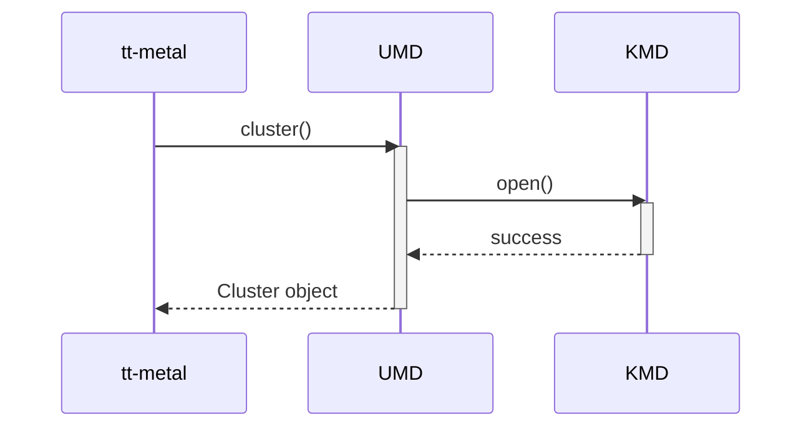

# Diagram review — Cluster Construction

This supplemental Markdown review covers the **Cluster Construction** sequence in [the target SAD](/home/hoangb/BOS/sad-review/review-input/sad/umd-kmd-sad.md:186), lines 188–202. It records the existing approved review assessment; it does not propose a replacement design or create new finding IDs. See the [diagram review index](README.md) and the [complete Cluster interface review](../interfaces/01-cluster.md) for the full SAD-01 through SAD-09 checklist.

## Scope and provenance

- SAD: `review-input/sad/umd-kmd-sad.md`, revision 0.1, 2026-09-15.
- Controlled criteria: `review-input/checklist/sad-review-checklist.md` and `review-input/guideline/sad-writing-guideline.md`, approved snapshots recorded in the [scope lock](../scope.lock).
- UMD: `source/bos-umd`, branch `develop`, commit `86e0ab17209d7af8f741ac34c158ebbf71612ea4`.
- KMD: `source/bos-kmd`, branch `develop`, commit `12d235aeedb8aa55ede24927c9e09f88c8f278c4`.
- Original [scope version 2](../scope.md) remains the review basis. The user's subsequent request explicitly authorizes this additional output under `review/diagram/`; the locked inputs, baselines, criteria and exclusions remain unchanged.
- Related SAD locations: Overview lines 20–29, Static View lines 35–48, Cluster contract lines 52–63 and Dynamic View lines 186–202. No controlled SRS is supplied.

Evidence is separated as `CONTROLLED RULE`, `DOCUMENT FACT`, `IMPLEMENTATION EVIDENCE`, `REVIEW OBSERVATION` and `OPEN ISSUE`. No assumption supplies missing intended behavior.

## Original diagram

`DOCUMENT FACT` — reproduced verbatim from SAD lines 188–202, including the original capitalization and messages.

## Applicable controlled rules

| Rule | Source and applicability |
|---|---|
| SAD-03 | [Checklist line 19](/home/hoangb/BOS/sad-review/review-input/checklist/sad-review-checklist.md:19): “Are component-level behaviors and interactions defined for applicable modes, startup/shutdown, error/recovery flows, and concurrency?” Cluster creation and initialization is meaningful startup behavior. |
| Architecture behavior sufficient for verification | [Guideline §3.2, lines 238–241](/home/hoangb/BOS/sad-review/review-input/guideline/sad-writing-guideline.md:238) requires component internal and inter-component behavior, including major processing, decisions, relevant state/data and observable results, at a level sufficient for applicable component and integration verification. |
| Applicability and representation | [Guideline lines 243–257](/home/hoangb/BOS/sad-review/review-input/guideline/sad-writing-guideline.md:243) recommends an Activity Diagram and makes coverage depend on behavior and verification needs. Its absence alone is not a failure; no universal reset, threading, timing or concurrency model is imposed. |
| Referenced behavior | [Checklist line 31](/home/hoangb/BOS/sad-review/review-input/checklist/sad-review-checklist.md:31) permits architecture-level dynamic evidence in another controlled artifact only when clearly referenced by the SAD and included in scope. No such artifact is supplied here. |
| Related boundary and contract obligations | [Guideline lines 135, 146–155](/home/hoangb/BOS/sad-review/review-input/guideline/sad-writing-guideline.md:135) addresses component responsibilities/design scopes and sufficient external contracts. [Lines 219–224](/home/hoangb/BOS/sad-review/review-input/guideline/sad-writing-guideline.md:219) address interface conditions and success/error results. These support existing SAD-F-001 and SAD-F-101, retained as context below. |

## Direct document evidence and positive support

`DOCUMENT FACT` — the diagram identifies the application, UMD and KMD as separate participants. It shows the direction and order of a construction request, a kernel open, successful return and creation of a Cluster object. This supports the broad caller → UMD → KMD relationship stated in the Overview and Static View.

The [Cluster contract](/home/hoangb/BOS/sad-review/review-input/sad/umd-kmd-sad.md:52), lines 52–63, promises creation and initialization for accelerator devices detected on the host; it specifies Input `None` and explicitly says constructors do not return a value. The `Cluster object` message can therefore represent the outcome of construction. It is not evidence that the SAD defines a C++ constructor return value.

The sequence's complete processing is `cluster()` → `open()` → `success` → `Cluster object`. Neither the sequence nor accompanying contract defines major initialization processing, relevant readiness state or what successful initialization guarantees. The contract's constraint entry is `-`. The complete SAD supplies no referenced architecture-level description that closes this gap.

## Consistency across views

| Comparison | Assessment and evidence class |
|---|---|
| Overview ↔ Static View | `DOCUMENT FACT`: cluster creation/initialization and the required KMD interface (SAD 26–28) correspond to the Cluster Management and Character Device edges (41, 47). |
| Static View ↔ sequence | `DOCUMENT FACT`: application, UMD and KMD remain distinct; the sequence shows the same broad dependency. Distinct nodes do not, by themselves, define separate software component responsibilities and design scopes. Only UMD has an Overview entry; the KMD component specification remains incomplete (SAD-F-001). |
| Interface Description ↔ sequence | `DOCUMENT FACT`: no input arguments and object creation are broadly consistent. Initialization is promised, but its meaning is underspecified in both views (SAD-F-101 and SAD-F-102). This is incomplete behavioral definition, not a demonstrated contradiction between their basic meanings. |
| Exact operation label | `REVIEW OBSERVATION`: the table uses `Cluster()` while the sequence uses `cluster()`. Existing CLU-NAME asks whether this is notation or an exact symbol. No new formal contradiction is asserted. |
| Requirements semantics | `OPEN ISSUE`: the controlled requirements baseline is absent. Internal-view agreement cannot establish consistency with requirements. |

## UMD implementation evidence

`IMPLEMENTATION EVIDENCE` — the following is observed source behavior at the pinned UMD commit. It does not establish intended initialization semantics.

| Evidence | File / symbol / lines | Observed behavior and limit |
|---|---|---|
| UMD-EV-003 | [cluster.h:82](/home/hoangb/BOS/sad-review/source/bos-umd/device/blackholeplus/cluster.h:82), `Cluster(ClusterOptions options = {})`; [cluster.cpp:265](/home/hoangb/BOS/sad-review/source/bos-umd/device/blackholeplus/cluster.cpp:265), lines 265–334, `verify_cluster_options` / `Cluster::Cluster` | Defaulted options permit a no-argument call. Construction validates options, obtains a descriptor, selects chips and constructs chip resources. Optional arguments do not contradict the SAD's no-input example. |
| UMD-EV-002/003 | [pci_device.cpp:105](/home/hoangb/BOS/sad-review/source/bos-umd/device/blackholeplus/pci_device.cpp:105), lines 105–165, enumeration/identity helpers; [cluster.cpp:738](/home/hoangb/BOS/sad-review/source/bos-umd/device/blackholeplus/cluster.cpp:738), lines 738–794, `create_cluster_descriptor` | The inspected path enumerates numeric `/dev/bos` entries, queries identity and builds logical-to-PCI mappings. Failed per-node information queries may be skipped. No intended device-selection or partial-discovery policy follows from this code alone. |
| UMD-EV-004 | [pci_device.cpp:170](/home/hoangb/BOS/sad-review/source/bos-umd/device/blackholeplus/pci_device.cpp:170), lines 170–308, `PCIDevice::PCIDevice` | Opens a node, obtains device information and mapping descriptors, and creates BAR0 WC / BAR2 UC / BAR4 UC mappings. An actual UMD→KMD open supports the diagram's call. Additional setup does not prove the abstract sequence denies those steps. |
| UMD-EV-011 | [local_chip.cpp:28](/home/hoangb/BOS/sad-review/source/bos-umd/device/blackholeplus/local_chip.cpp:28), lines 28–94, local-chip construction; [cluster.cpp:662](/home/hoangb/BOS/sad-review/source/bos-umd/device/blackholeplus/cluster.cpp:662), lines 662–678, `start_device` / `close_device`; [pci_device.cpp:310](/home/hoangb/BOS/sad-review/source/bos-umd/device/blackholeplus/pci_device.cpp:310), lines 310–324, destructor | Source includes local resource initialization, separate start/close methods and mapping teardown. Their existence raises a readiness/lifetime decision; it does not prescribe which steps the intended constructor must guarantee. |

The selected checked-in path follows `EAGLE_AS_TT=ON` ([CMakeLists.txt:58](/home/hoangb/BOS/sad-review/source/bos-umd/CMakeLists.txt:58), lines 58–62; [device/CMakeLists.txt:64](/home/hoangb/BOS/sad-review/source/bos-umd/device/CMakeLists.txt:64), lines 64–92). This is a source-selection fact, not a deployed-configuration claim. See the [UMD evidence ledger](../evidence/umd-code-evidence.md) for the full evidence limits.

## KMD implementation evidence

`IMPLEMENTATION EVIDENCE` — KMD supplies per-device kernel services; it does not construct the C++ Cluster object.

| Evidence | File / symbol / lines | Observed behavior and limit |
|---|---|---|
| KMD-EV-002 | [enumerate.c:48](/home/hoangb/BOS/sad-review/source/bos-kmd/enumerate.c:48), lines 48–147, PCI probe; [chardev.c:81](/home/hoangb/BOS/sad-review/source/bos-kmd/chardev.c:81), lines 81–104, device-node setup | Probe allocates device ordinals and creates `bos/N` character-device instances. This supports device availability, without defining intended UMD topology or selection semantics. |
| KMD-EV-010 | [chardev.c:431](/home/hoangb/BOS/sad-review/source/bos-kmd/chardev.c:431), lines 431–499, `tt_cdev_open` / `tt_cdev_release` | Open allocates per-file state and holds a device reference. Release cleans file-owned resources and TLB/lock ownership. Open success is a kernel file-lifetime result, not proof of the SAD's complete cluster-readiness guarantee. |
| KMD-EV-003/004 | [chardev.c:111](/home/hoangb/BOS/sad-review/source/bos-kmd/chardev.c:111), lines 111–142, device-info handler; [memory.c:372](/home/hoangb/BOS/sad-review/source/bos-kmd/memory.c:372), lines 372–449, `ioctl_query_mappings`; [ioctl.h:12](/home/hoangb/BOS/sad-review/source/bos-kmd/ioctl.h:12), lines 12–83 | KMD provides the queried identity and mappings. Inspected command values, field layout and mapping IDs agree with [UMD device/ioctl.h:18](/home/hoangb/BOS/sad-review/source/bos-umd/device/ioctl.h:18), lines 18–83. Agreement is bounded to these exchanges, without full ABI/runtime compatibility validation. |
| KMD-EV-005 | [chardev.c:403](/home/hoangb/BOS/sad-review/source/bos-kmd/chardev.c:403), lines 403–408, `tt_cdev_mmap`; [memory.c:1186](/home/hoangb/BOS/sad-review/source/bos-kmd/memory.c:1186), lines 1186–1237, mmap dispatcher | KMD establishes supported VMAs for userspace access. This supports setup observed in UMD; a required exact architecture sequence still needs the owner's contract. |

The checked-in KMD build defines `BLACKHOLEPLUS` ([Makefile:13](/home/hoangb/BOS/sad-review/source/bos-kmd/Makefile:13), lines 13–14). Existing KMD-EV-013 records that some probe initialization is skipped while callbacks remain defined ([enumerate.c:119](/home/hoangb/BOS/sad-review/source/bos-kmd/enumerate.c:119), lines 119–127; [blackhole.c:804](/home/hoangb/BOS/sad-review/source/bos-kmd/blackhole.c:804), lines 804–838 and 992–1014). Supported optional callbacks and readiness prerequisites remain an open question, not a reproduced defect. See the [KMD evidence ledger](../evidence/kmd-code-evidence.md).

## Applicable assessment

These are the existing interface results relevant to this diagram, not a replacement checklist or a new set of findings.

| Criterion / question | Existing result | Diagram-specific basis |
|---|---|---|
| SAD-03 — initialization behavior sufficient for verification | **Fail** | Major initialization processing and observable completion are undefined despite the stated initialization purpose; SAD-F-102. |
| SAD-01 — component responsibilities/boundaries | **Fail**, related context | Separate UMD/KMD participants are present; separate component specifications/design scopes are incomplete; SAD-F-001. |
| SAD-02 — conditions/results and boundary contract | **Fail**, related context | Initialized completion, failure outcome and kernel-resource relationship are underspecified; SAD-F-101. |
| SAD-04 — bidirectional requirements allocation | **Blocked** | No controlled SRS/requirements baseline. No requirements failure is inferred. |
| SAD-05 — internal consistency | **Pass, bounded to internal views** | Basic construction meaning and dependency direction agree. Requirements-semantic consistency remains unassessed. |
| SAD-to-UMD/KMD correspondence | **Partial** traceability mapping | Open and separate kernel participation are supported; intended initialization semantics and ownership remain incomplete. This mapping status is not a separate checklist outcome. |

SAD-06 through SAD-09 retain their full treatment in the [independent Cluster review](../interfaces/01-cluster.md). In particular, SAD-09 remains N/A to external PM/planning assessment within the supplied scope; this diagram output does not infer an external process failure.

## Existing dynamic-view finding

### SAD-F-102 — Initialization behavior is not described beyond open success

- **Classification:** Process / guideline finding.
- **Severity:** Major.
- **Controlled criterion:** SAD-03, checklist lines 19 and 31; Guideline §3.2 lines 238, 240 and 255.
- **Applicability:** The contract explicitly promises cluster creation and initialization, so meaningful component behavior must be described sufficiently for verification.
- **Direct document evidence:** SAD line 54 promises initialization. The complete sequence at lines 188–202 contains only `cluster()`, `open()`, `success` and object creation; no major initialization processing, decisions or state are described elsewhere or referenced.
- **Issue:** The intended initialization behavior and completion cannot be derived from the supplied architecture evidence. Implementation steps cannot substitute for that missing definition.
- **Impact:** Implementers and integration tests can use different initialization scenarios and readiness assumptions.
- **Suggested correction:** The architecture owner should document major initialization processing, decisions and observable completion, and determine applicable lifecycle/error scenarios. This does not mandate an Activity Diagram, the current source's exact discovery algorithm or an invented reset/threading model.
- **Traceability:** Requirement / verification condition: not supplied. SAD element: Cluster Construction. Supporting implementation context: UMD-EV-002/003/004/011; KMD-EV-002/010.
- **Canonical record:** [Cluster interface finding](/home/hoangb/BOS/sad-review/review/interfaces/01-cluster.md:175); [findings index](../findings/findings.md). This reproduction does not increase the finding count.

Related SAD-F-001 (component scope) and SAD-F-101 (completion/boundary contract) remain distinct concerns. No new Cluster implementation-drift finding is created: omitted source detail is not automatically a contradictory SAD statement.

## Decisions required and traceability limits

| Existing decision | Classification | Required resolution |
|---|---|---|
| CLU-READY | `OPEN ISSUE` / Decision required | Define constructed versus started readiness, device selection, partial discovery/failure behavior, and ownership of mappings and shutdown. Establish which error/recovery, state and concurrency scenarios are applicable. The source cannot select the intended policy. |
| CLU-VARIANT | `OPEN ISSUE` / Decision required | Identify the intended supported architecture/build variant before treating default source paths as the target design. |
| CLU-ABI | `OPEN ISSUE` / Decision required | Establish the version/compatibility contract. Matching inspected query layouts is positive evidence; differing API constants alone do not prove incompatibility. |
| CLU-NAME | `REVIEW OBSERVATION` | Clarify whether `cluster()` is informal sequence notation for `Cluster()`. |
| CLU-REQ | `OPEN ISSUE` / Missing evidence | Supply an approved requirements baseline if requirements review is requested. Both requirement → flow/code and flow → justifying requirement remain **Blocked**; adding a controlled input requires renewed scope approval. |

The [traceability ledger](../evidence/traceability.md) records the no-argument constructor as covered only for callability and the open/initialization flow as partial. No requirement IDs, thresholds or architecture behavior are invented.

## Final diagram result and limitations

**Diagram result: Fail for SAD-03, based on existing Major finding SAD-F-102. Requirements coverage: Blocked.** The broad participants, open interaction and object-creation outcome are supported; they do not close the initialization-behavior gap.

This is a read-only, static review of preserved Mermaid text and the pinned source evidence. No build, hardware, runtime, fault, concurrency or deployed ABI test was performed. No external SUD, firmware/hardware specification, wrapper, PM record or unseen image supplies missing behavior. No protected input, source repository, scope record or scope lock was changed. This supplemental file preserves the existing review outcome and leaves complete interface assessment in its separate canonical file.
