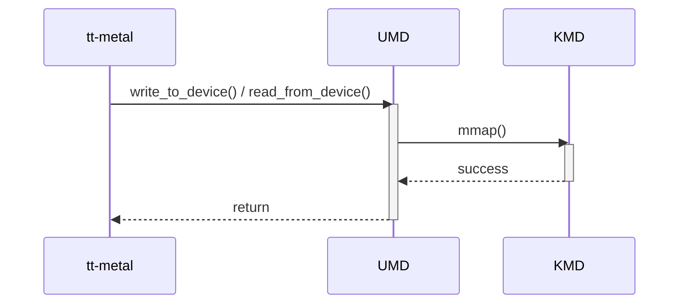

# Device Memory Write/Read — SAD Diagram Review

## Scope and provenance

Target: [umd-kmd-sad.md](../../review-input/sad/umd-kmd-sad.md), revision 0.1 (September 15, 2026). This record reviews the diagram at SAD:204–220 against its interface contract at SAD:65–100, the Overview/static model, and the approved implementation evidence. The user explicitly requested supplemental diagram outputs under `review/diagram/`; the controlled scope and original [scope lock](../scope.lock) remain unchanged. [Diagram index](README.md).

- UMD baseline: `develop @ 86e0ab17209d7af8f741ac34c158ebbf71612ea4`.
- KMD baseline: `develop @ 12d235aeedb8aa55ede24927c9e09f88c8f278c4`.
- SAD SHA-256: `87d325a8d5cefbfa58e84b369bd8cb4f79e7fe81663203ae6165c954f3afc6ec`.
- CL: [controlled checklist](../../review-input/checklist/sad-review-checklist.md); GL: [controlled guideline](../../review-input/guideline/sad-writing-guideline.md). Citations use one-based source line spans.

This is a diagram-focused assessment. The complete SAD-01–SAD-09 checklist remains in the [independent interface review](../interfaces/02-device-memory-access.md). Evidence classes are explicit below. No assumption supplies intended behavior, and no new finding ID is introduced.

## Original diagram — DOCUMENT FACT

The following Mermaid block is copied exactly from SAD:206–220. It is the reviewed source diagram, not a proposed replacement.

## Applicable controlled rules

| CONTROLLED RULE | Applicability to this diagram |
|---|---|
| SAD-03, CL:19,31 | Component-level behavior/interactions must cover applicable modes, lifecycle, errors/recovery and concurrency. An alternate controlled dynamic view must be referenced and in scope; none is supplied here. |
| GL:238–241,255 | This interface promises meaningful runtime access. Major processing, decisions and observable results need enough detail for applicable component/integration verification. |
| GL:243,245,247,253–259 | Diagram form and scenario depth depend on behavior and verification significance. Activity Diagrams are recommended, not universally mandatory; no specific unestablished state/error/concurrency policy is imposed. |
| SAD-02/SAD-05, CL:18,21; GL:219–224 | The sequence's purpose, conditions and results must agree with the surrounding interface contract. Exact contract gaps remain in the independent interface review. |
| SAD-04, CL:20; approved user override | Requirement-based behavior allocation is Blocked without the controlled SRS; code cannot substitute for requirements. |

## Document facts and positive support

- SAD:212 sends `write_to_device() / read_from_device()` from tt-metal to UMD.
- SAD:214 shows UMD calling KMD `mmap()`; SAD:216 shows `success`; SAD:218 shows a generic `return` to the caller.
- UMD and KMD are separate participants. Both activations are explicitly ended on the depicted success path.
- No payload-processing step, read-data exchange, meaningful internal decision or transfer-completion condition is shown. No controlled alternative dynamic description is referenced in the complete SAD.
- The contract promises memory access for a core/address (SAD:67–68), identifies source/read buffers (74,97), and requires a valid accessible target for the selected device (99). The generic return does not explain how the promised operation is fulfilled.

## Consistency across views

The Overview includes memory access (SAD:26–27), the static edge is `Memory Read/Write` (42), and the interface and sequence use the same operation names (67,212). This category-level consistency is positive support. The required KMD relationship also agrees with the static graph (47). It does not establish whether mapping setup belongs inside each read/write invocation.

The read-buffer passing/ownership and address/device model remain underspecified in the interface contract (SAD-F-201). The read-size wording defect at SAD:84 belongs to the interface table (SAD-F-203); it is not a new diagram finding. The diagram’s combined read/write label alone is not a defect: shared behavior may be shown together if data direction and outcomes are made clear.

UMD and KMD are separately drawn. Complete component identities/design scopes and mapping/transfer ownership are still missing in the surrounding model (shared SAD-F-001). That is context for responsibility allocation, not a new claim that the diagram lacks separate participants.

## UMD implementation evidence

`IMPLEMENTATION EVIDENCE` at the pinned UMD commit; no intended architecture is inferred. Full evidence records: [UMD ledger](../evidence/umd-code-evidence.md).

| Evidence ID | File / symbol | Observed behavior and limitation |
|---|---|---|
| UMD-EV-004 | source/bos-umd/device/blackholeplus/pci_device.cpp:193–324; PCIDevice constructor/destructor | Queries mapping descriptors, establishes/stores BAR mappings during device setup, and later unmaps them. This is a persistent mapping lifetime, not a fresh mapping per ordinary transfer. |
| UMD-EV-005 | source/bos-umd/device/blackholeplus/cluster.h:271–285; source/bos-umd/device/blackholeplus/cluster.cpp:576–600; public memory methods | Selects chip/core and forwards a caller buffer; both functions return void. Precise signature differences are related API drift, not proof of intended semantics. |
| UMD-EV-006 | source/bos-umd/device/blackholeplus/local_chip.cpp:177–205; memory dispatch | Routes supported targets to DRAM or Tensix access and rejects other cores. This is observed routing only. |
| UMD-EV-006 | source/bos-umd/device/blackholeplus/blackhole_tt_device.cpp:469–627,717–841; DRAM/Tensix memory helpers | Transfers through established BAR0 or BAR2 resources. DRAM window changes can use BAR4 AP/ATU requests; these changes are not host mmap calls. |
| UMD-EV-006 / UMD-EV-010 | source/bos-umd/device/blackholeplus/blackhole_tt_device.cpp:232–310; source/bos-umd/device/blackholeplus/tt_device.cpp:95–195; AP and device-copy helpers | Response waits/checks and device-memory copies occur after setup. No per-transfer mmap is present in the inspected chain; no controlled timing/concurrency guarantee is inferred. |

## KMD implementation evidence

`IMPLEMENTATION EVIDENCE` at the pinned KMD commit. Direct setup participation is distinguished from transfer execution. Full records: [KMD ledger](../evidence/kmd-code-evidence.md).

| Evidence ID | File / symbol | Observed behavior and limitation |
|---|---|---|
| KMD-EV-004 | source/bos-kmd/memory.c:372–449; ioctl_query_mappings | Returns BAR mapping identifiers, file offsets and sizes; these are not application memory addresses or payload results. |
| KMD-EV-005 | source/bos-kmd/chardev.c:403–408; source/bos-kmd/memory.c:1186–1237; tt_cdev_mmap / bos_mmap | Establishes BAR/TLB/DMA VMAs or rejects an unmatched request. The handler does not perform the application memory payload copy. |
| KMD-EV-003 / KMD-EV-010 | source/bos-kmd/chardev.c:36–42,431–499; chardev_fops and open/release | Exposes open/release/ioctl/mmap and separate file-owned cleanup. This supports setup/lifetime participation, not a kernel payload call per UMD access. |

## Diagram assessment

These are bounded checks, not a replacement for the full interface checklist.

| Check | Result / classification | Basis |
|---|---|---|
| Basic participant/call-category consistency | Supported | Caller, UMD/KMD dependency and operation names correspond across the views; this is not complete component-contract acceptance. |
| Meaningful component processing and observable completion | Fail — formal SAD-03 gap | SAD-F-202: the only depicted kernel action is mapping, without the promised payload transaction. |
| SAD-to-implementation order/lifetime | Conflicting — Implementation drift | SAD-F-205: setup-time mappings are reused by the inspected access path; the diagram places mmap inside the access. |
| Applicability of further mode/error/recovery/concurrency scenarios | Missing evidence / Decision required | Intended applicable scenarios must be established; source checks and reviewer preferences do not define them. |
| Requirement allocation and requirement-based scenario completeness | Blocked | No controlled SRS. |

## Existing findings relevant to this diagram

The records below preserve the existing interface-review IDs and classifications. They are not additional defects in the overall register. Other contract/table findings remain in the linked interface review.

### SAD-F-202 — Memory sequence does not describe the payload operation

**Classification:** Process / guideline finding

**Severity:** Major

**Checklist:** SAD-03

**Guideline / controlled criterion:** CL:19,31; GL:238,240,255 require major component processing and observable results sufficient for verification.

**Location:** SAD:68,204–220

**Evidence:** DOCUMENT FACT — The promised read/write sequence contains the caller API, KMD mmap(), success and return, without data-transfer processing or its observable completion. No other controlled dynamic description is referenced.

**Issue:** A mapping-success exchange does not explain the promised memory behavior in this document. No particular algorithm or per-core code implementation is imposed.

**Impact:** Integration verification cannot distinguish access setup from fulfillment of the read/write request.

**Suggested correction:** Describe intended setup versus payload processing and completion; identify applicable conditions/error/lifecycle cases at architecture level.

**Traceability:** Requirement / VC: Not supplied. SAD element: Device Memory Write/Read. Implementation evidence: UMD-EV-004/006; KMD-EV-005 (alignment context).

### SAD-F-205 — Memory mapping occurs at setup in the inspected implementation

**Classification:** Implementation drift

**Checklist:** SAD-03

**Guideline / controlled criterion:** CL:19; GL:238–257 provides dynamic-alignment context, not code-derived requirements.

**Location:** SAD:212–218; source/bos-umd/device/blackholeplus/pci_device.cpp:193–324; source/bos-kmd/memory.c:1186–1237

**Evidence:** DOCUMENT FACT — mmap follows the public access call in the sequence. IMPLEMENTATION EVIDENCE — BARs are mapped in the PCI-device constructor, and the ordinary memory methods transfer through saved mappings; KMD mmap establishes VMAs.

**Issue:** The shown lifetime/order differs from the inspected default BOS path. ATU-window programming through BAR4 is not an mmap syscall.

**Impact:** The diagram can lead to an incorrect allocation of setup and transfer responsibilities.

**Suggested correction:** Domain owner decision required on intended mapping/access lifecycle, followed by reconciliation without assuming source is intended truth.

**Traceability:** Requirement / VC: Not supplied. SAD element: Memory dynamic view. Implementation evidence: UMD-EV-004/006; KMD-EV-004/005.

## Decisions required and open issues

`OPEN ISSUE` — these are owner decisions or missing evidence, not reviewer-authored behavior.

| Existing ID | Classification | Required decision / missing evidence |
|---|---|---|
| MEM-FLOW | Decision required | Decide the intended setup/access lifecycle and distinguish host mapping, device-window changes and payload movement before reconciling the sequence. |
| MEM-MODEL | Decision required | Define selected device, address domain, buffer ownership and what successful read/write completion guarantees. |
| MEM-SERIAL | Missing evidence | Establish applicable caller serialization, mapping invalidation/removal and shared AP/ATU access assumptions; source checks do not prove end-to-end concurrency safety. |
| MEM-VARIANT | Decision required | Identify the intended implementation/build variant; the checked-in default is not an architecture decision. |
| MEM-REQ | Missing evidence | Controlled requirements are unavailable; bidirectional traceability and requirement-based scenario completeness remain Blocked. |

## Traceability

| Source proposition | Evidence | Status / limitation |
|---|---|---|
| Named access API and broad purpose | Interface contract, sequence and UMD public declarations | Partial: broad correspondence does not close exact contract semantics. |
| Mapping inside the access sequence | UMD-EV-004/006; KMD-EV-004/005 | Conflicting for the inspected default BOS path; the intended lifecycle remains an owner decision. |
| Requirement → interface/flow → implementation | Controlled requirement / VC: Not supplied | Blocked. |
| Interface/flow → justifying requirement | Controlled requirement / VC: Not supplied | Blocked. |

Reverse mapping: The source’s direct Tensix BAR2 and DRAM BAR0/AP-window routes broadly map to memory access, but their intended allocation, completion and lifetime are not defined in the SAD. KMD mapping offsets must not be equated to device addresses. Exposed DMA facilities do not prove these ordinary methods use DMA.

See [document evidence DOC-03](../evidence/document-evidence.md) and [bidirectional traceability](../evidence/traceability.md). No requirement IDs or thresholds are invented.

## Final diagram result and limitations

**Assessed Dynamic View result: Fail (SAD-03). Requirements coverage: Blocked.** The diagram does not describe the promised memory payload behavior sufficiently for applicable verification (SAD-F-202). The mapping-order/lifetime difference is separately recorded as implementation drift (SAD-F-205).

The review covers the diagram and its supporting controlled context at the locked baselines. No build, runtime/hardware, timing, concurrency, fault-injection or deployed-ABI test was performed. UMD follows the checked-in default BOS/Blackholeplus chain; a source default is not intended/deployed configuration. KMD facilities do not imply a kernel call on every UMD operation. Source-only details do not become architecture requirements.

The original diagram and all protected inputs/source remain unchanged. Existing global findings and full-interface checklist results remain authoritative; PM/planning evidence stays outside this diagram assessment, with the prior SAD-09 scope qualification retained.
