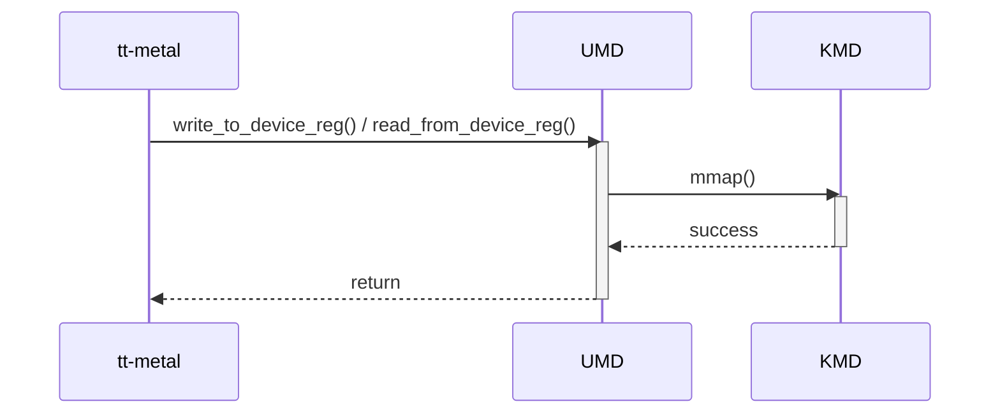

# Device Register Write/Read — SAD Diagram Review

## Scope and provenance

Target: [umd-kmd-sad.md](../../review-input/sad/umd-kmd-sad.md), revision 0.1 (September 15, 2026). This record reviews the diagram at SAD:222–238 against its interface contract at SAD:102–137, the Overview/static model, and the approved implementation evidence. The user explicitly requested supplemental diagram outputs under `review/diagram/`; the controlled scope and original [scope lock](../scope.lock) remain unchanged. [Diagram index](README.md).

- UMD baseline: `develop @ 86e0ab17209d7af8f741ac34c158ebbf71612ea4`.
- KMD baseline: `develop @ 12d235aeedb8aa55ede24927c9e09f88c8f278c4`.
- SAD SHA-256: `87d325a8d5cefbfa58e84b369bd8cb4f79e7fe81663203ae6165c954f3afc6ec`.
- CL: [controlled checklist](../../review-input/checklist/sad-review-checklist.md); GL: [controlled guideline](../../review-input/guideline/sad-writing-guideline.md). Citations use one-based source line spans.

This is a diagram-focused assessment. The complete SAD-01–SAD-09 checklist remains in the [independent interface review](../interfaces/03-device-register-access.md). Evidence classes are explicit below. No assumption supplies intended behavior, and no new finding ID is introduced.

## Original diagram — DOCUMENT FACT

The following Mermaid block is copied exactly from SAD:224–238. It is the reviewed source diagram, not a proposed replacement.

## Applicable controlled rules

| CONTROLLED RULE | Applicability to this diagram |
|---|---|
| SAD-03, CL:19,31 | Component-level behavior/interactions must cover applicable modes, lifecycle, errors/recovery and concurrency. An alternate controlled dynamic view must be referenced and in scope; none is supplied here. |
| GL:238–241,255 | This interface promises meaningful runtime access. Major processing, decisions and observable results need enough detail for applicable component/integration verification. |
| GL:243,245,247,253–259 | Diagram form and scenario depth depend on behavior and verification significance. Activity Diagrams are recommended, not universally mandatory; no specific unestablished state/error/concurrency policy is imposed. |
| SAD-02/SAD-05, CL:18,21; GL:219–224 | The sequence's purpose, conditions and results must agree with the surrounding interface contract. Exact contract gaps remain in the independent interface review. |
| SAD-04, CL:20; approved user override | Requirement-based behavior allocation is Blocked without the controlled SRS; code cannot substitute for requirements. |

## Document facts and positive support

- SAD:230 sends `write_to_device_reg() / read_from_device_reg()` from tt-metal to UMD.
- SAD:232 shows UMD calling KMD `mmap()`; SAD:234 returns `success`; SAD:236 shows a generic `return` to the caller.
- UMD and KMD are separate participants with explicitly ended activations on the shown success path.
- The sequence shows no register transaction processing, value exchange or completion condition. The complete SAD references no other controlled dynamic description that supplies this behavior.
- The contract promises register access for a target core/address (SAD:104–105), supplies size and source/read buffers (110–134), and requires a valid accessible register address (136). Mapping success does not define fulfillment of that register operation.

## Consistency across views

The Overview includes register access (SAD:26–27), the static graph names `Register Read/Write` (43), and the detailed operation names match the sequence call (104,230). The broad caller/UMD/KMD relationship is consistent. A static dependency does not imply a kernel call for every register operation.

The register interface’s memory-operation output labels and address terminology at SAD:112,123,130 are related table inconsistencies (SAD-F-303). Caller semantics and exact signature/alignment differences are covered by SAD-F-301/304. These are not reclassified as new diagram findings. Combining read/write in one diagram is not inherently wrong; the behavior still needs sufficient data/result meaning for verification.

UMD and KMD are separately drawn. Complete component identities/design scopes and mapping/transfer ownership are still missing in the surrounding model (shared SAD-F-001). That is context for responsibility allocation, not a new claim that the diagram lacks separate participants.

## UMD implementation evidence

`IMPLEMENTATION EVIDENCE` at the pinned UMD commit; no intended architecture is inferred. Full evidence records: [UMD ledger](../evidence/umd-code-evidence.md).

| Evidence ID | File / symbol | Observed behavior and limitation |
|---|---|---|
| UMD-EV-004 | source/bos-umd/device/blackholeplus/pci_device.cpp:193–324; PCIDevice constructor/destructor | Establishes/stores BAR mappings during device setup and later unmaps them. The inspected register methods reuse these mappings. |
| UMD-EV-005 | source/bos-umd/device/blackholeplus/cluster.h:300–316; source/bos-umd/device/blackholeplus/cluster.cpp:581–605; public register methods | Takes explicit chip/core/address/size and a caller buffer, then forwards access. Both methods return void. Source signatures do not resolve intended completion semantics. |
| UMD-EV-007 | source/bos-umd/device/blackholeplus/local_chip.cpp:266–310; register dispatch | Checks size/address divisibility by four and dispatches supported DRAM/Tensix targets. These observed checks are not new requirements. |
| UMD-EV-007 | source/bos-umd/device/blackholeplus/blackhole_tt_device.cpp:843–959; Tensix register helpers | Checks range/static mapping, derives the BAR2 address and performs a mapped register access. No new mmap call occurs. |
| UMD-EV-007 | source/bos-umd/device/blackholeplus/blackhole_tt_device.cpp:313–446,962–1018; DRAM register/AP helpers | Translates DRAM-core register addresses and uses BAR4 AP packets. Inspected helpers transfer one uint32_t despite a length-bearing public API. Width/ordering intent and any runtime defect are not established by that observation alone. |

## KMD implementation evidence

`IMPLEMENTATION EVIDENCE` at the pinned KMD commit. Direct setup participation is distinguished from transfer execution. Full records: [KMD ledger](../evidence/kmd-code-evidence.md).

| Evidence ID | File / symbol | Observed behavior and limitation |
|---|---|---|
| KMD-EV-004 / KMD-EV-005 | source/bos-kmd/memory.c:372–449,1186–1237; source/bos-kmd/chardev.c:403–408; mapping query / mmap | Supplies mapping descriptors and establishes VMAs. These are supporting setup operations, not the implementation of the public register payload functions. |
| KMD-EV-010 | source/bos-kmd/chardev.c:431–499; tt_cdev_open / tt_cdev_release | Owns per-file state and cleanup independently of a register read/write invocation. End-to-end reset/removal behavior is unproven. |
| KMD-EV-006 / KMD-EV-013 | source/bos-kmd/blackhole.c:152–175; source/bos-kmd/enumerate.c:119–127; TLB configuration and probe condition | Retained TLB callbacks write configuration registers, but are not shown to implement the public register API. Optional callback support under the selected build remains an open issue, not a proved fault. |

## Diagram assessment

These are bounded checks, not a replacement for the full interface checklist.

| Check | Result / classification | Basis |
|---|---|---|
| Basic participant/call-category consistency | Supported | Caller, UMD/KMD dependency and operation names correspond across the views; this is not complete component-contract acceptance. |
| Meaningful component processing and observable completion | Fail — formal SAD-03 gap | SAD-F-302: the only depicted kernel action is mapping, without the promised payload transaction. |
| SAD-to-implementation order/lifetime | Conflicting — Implementation drift | SAD-F-305: setup-time mappings are reused by the inspected access path; the diagram places mmap inside the access. |
| Applicability of further mode/error/recovery/concurrency scenarios | Missing evidence / Decision required | Intended applicable scenarios must be established; source checks and reviewer preferences do not define them. |
| Requirement allocation and requirement-based scenario completeness | Blocked | No controlled SRS. |

## Existing findings relevant to this diagram

The records below preserve the existing interface-review IDs and classifications. They are not additional defects in the overall register. Other contract/table findings remain in the linked interface review.

### SAD-F-302 — Register transaction behavior is absent from the sequence

**Classification:** Process / guideline finding

**Severity:** Major

**Checklist:** SAD-03

**Guideline / controlled criterion:** CL:19,31; GL:238,240,255 requires major processing and observable results for meaningful runtime behavior.

**Location:** SAD:105,222–238

**Evidence:** DOCUMENT FACT — The sequence has the register API, KMD mmap(), success and return, but no register-transfer processing or completion condition. No controlled alternate dynamic view is referenced.

**Issue:** Mapping success alone does not describe the document's promised register behavior. The issue exists without imposing the implementation's Tensix/AP routing.

**Impact:** Architecture-level tests cannot identify the intended register operation and completion boundary.

**Suggested correction:** Describe the intended transaction steps, component responsibilities, conditions and completion at the necessary architectural level.

**Traceability:** Requirement / VC: Not supplied. SAD element: Device Register Write/Read. Implementation evidence: UMD-EV-007; KMD-EV-005 (supporting comparison).

### SAD-F-305 — Register access reuses established mappings in the inspected source

**Classification:** Implementation drift

**Checklist:** SAD-03

**Guideline / controlled criterion:** CL:19; GL:238–257 provides dynamic-alignment context only.

**Location:** SAD:230–236; source/bos-umd/device/blackholeplus/pci_device.cpp:193–324; source/bos-umd/device/blackholeplus/blackhole_tt_device.cpp:843–1018

**Evidence:** DOCUMENT FACT — the sequence places mmap after each register call. IMPLEMENTATION EVIDENCE — constructor-time BAR mappings support subsequent Tensix BAR2 or DRAM-core BAR4/AP register operations; KMD mmap establishes the VMA.

**Issue:** The described order/lifetime differs from the inspected default path. Neither the source nor the simplified diagram establishes the intended architecture by itself.

**Impact:** Integration can confuse mapping setup with execution/completion of register operations.

**Suggested correction:** Reconcile the intended setup/access lifecycle and routing with architecture-owner confirmation.

**Traceability:** Requirement / VC: Not supplied. SAD element: Register dynamic view. Implementation evidence: UMD-EV-004/007; KMD-EV-005.

## Decisions required and open issues

`OPEN ISSUE` — these are owner decisions or missing evidence, not reviewer-authored behavior.

| Existing ID | Classification | Required decision / missing evidence |
|---|---|---|
| REG-ROUTE | Decision required | Resolve intended target domains, setup/access lifecycle and which routing distinctions belong in the architecture-level behavior. |
| REG-WIDTH | Decision required | Establish supported transaction width/size and buffer semantics. The AP helper alone cannot establish a required bulk-register behavior. |
| REG-ORDER | Missing evidence | Define applicable ordering, side effects, atomicity, completion, concurrent AP use and recovery assumptions. No specific policy is invented. |
| REG-VARIANT | Decision required | Identify the intended implementation/build variant before reconciling the sequence and source. |
| REG-REQ | Missing evidence | Controlled requirements are unavailable; bidirectional traceability and requirement-based scenario completeness remain Blocked. |

## Traceability

| Source proposition | Evidence | Status / limitation |
|---|---|---|
| Named access API and broad purpose | Interface contract, sequence and UMD public declarations | Partial: broad correspondence does not close exact contract semantics. |
| Mapping inside the access sequence | UMD-EV-004/007; KMD-EV-005 | Conflicting for the inspected default BOS path; the intended lifecycle remains an owner decision. |
| Requirement → interface/flow → implementation | Controlled requirement / VC: Not supplied | Blocked. |
| Interface/flow → justifying requirement | Controlled requirement / VC: Not supplied | Blocked. |

Reverse mapping: Direct Tensix register accesses and DRAM-core AP packets correspond to the broad register purpose but lack an intended architecture-level routing/completion allocation. Kernel TLB programming is a separate facility; it does not establish that ordinary public register access enters that kernel path.

See [document evidence DOC-03](../evidence/document-evidence.md) and [bidirectional traceability](../evidence/traceability.md). No requirement IDs or thresholds are invented.

## Final diagram result and limitations

**Assessed Dynamic View result: Fail (SAD-03). Requirements coverage: Blocked.** The sequence omits the promised register transaction behavior and completion (SAD-F-302). Reuse of setup-time mappings versus the depicted per-operation mmap is a separate implementation-drift record (SAD-F-305).

The review covers the diagram and its supporting controlled context at the locked baselines. No build, runtime/hardware, timing, concurrency, fault-injection or deployed-ABI test was performed. UMD follows the checked-in default BOS/Blackholeplus chain; a source default is not intended/deployed configuration. KMD facilities do not imply a kernel call on every UMD operation. Source-only details do not become architecture requirements.

The original diagram and all protected inputs/source remain unchanged. Existing global findings and full-interface checklist results remain authoritative; PM/planning evidence stays outside this diagram assessment, with the prior SAD-09 scope qualification retained.
