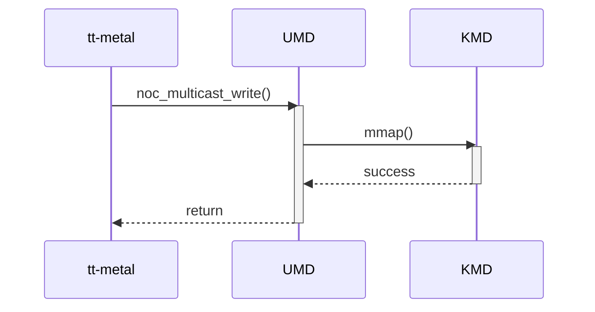

# Multicast Write — Diagram Review

## Scope and provenance

Reviewed 2026-10-08 against approved scope version 2. This file is an additional presentation of the existing review, explicitly requested under `review/diagram/`; it adds no controlled input, source baseline, criterion or finding ID. The original [scope](../scope.md) and [scope lock](../scope.lock) remain unchanged. See the [diagram index](README.md).

- Target: `review-input/sad/umd-kmd-sad.md`, revision 0.1 (2026-09-15), SHA-256 `87d325a8d5cefbfa58e84b369bd8cb4f79e7fe81663203ae6165c954f3afc6ec`.
- UMD: `source/bos-umd`, `develop @ 86e0ab17209d7af8f741ac34c158ebbf71612ea4`.
- KMD: `source/bos-kmd`, `develop @ 12d235aeedb8aa55ede24927c9e09f88c8f278c4`.
- Controlled criteria: `review-input/checklist/sad-review-checklist.md` (CL) and `review-input/guideline/sad-writing-guideline.md` (GL), with hashes in the lock. SAD references below identify one-based lines in the target.

Evidence classes are `CONTROLLED RULE`, `DOCUMENT FACT`, `IMPLEMENTATION EVIDENCE`, `REVIEW OBSERVATION` and `OPEN ISSUE`. No assumption supplies intended architecture. Source evidence describes the pinned implementation only.

This review covers the Multicast Write sequence at SAD:240–256, with its interface contract at 139–160 and Overview/static-view context at 20–48. The [independent multicast interface review](../interfaces/04-multicast-write.md) contains the complete SAD-01 through SAD-09 checklist and detailed contract findings.

## Original diagram

Exact Mermaid fence from [SAD:242–256](/home/hoangb/BOS/sad-review/review-input/sad/umd-kmd-sad.md:242), reproduced without redesign:

## Applicable controlled rules

| Criterion | Controlled requirement and applicability |
|---|---|
| SAD-03, CL:19,31 | Component-level behavior and interaction must cover applicable modes, startup/shutdown, error/recovery and concurrency. An alternative architecture-level description must be referenced and included in scope; unit-internal behavior alone is insufficient. This applies to the promised multicast write. |
| GL §3.2:238–241,255 | Runtime behavior must support applicable component/integration verification and describe major processing, decisions and observable results. The API promises to deliver a payload to multiple destination cores. |
| GL §3.2:243,245,247,253,257,259 | Activity Diagrams are recommended; applicable behavior and critical interactions determine required coverage. No particular fan-out algorithm, timing bound, additional KMD call or diagram format is required without evidence. Black-box omission is conditional. |
| SAD-01, CL:17; GL:135,146–151 | Responsibilities and design scope must be identified. Distinct lifelines do not by themselves assign multicast processing, mapping or completion responsibilities. |
| SAD-02/SAD-05, CL:18,21; GL:217–224 | Interface names, parameters, conditions and results must support integration/testing and stay consistent across the design. This supplies the comparison basis for the sequence's API and surrounding contract. |

Sources: [checklist](/home/hoangb/BOS/sad-review/review-input/checklist/sad-review-checklist.md:17), [dynamic-view rules](/home/hoangb/BOS/sad-review/review-input/guideline/sad-writing-guideline.md:238), [interface rules](/home/hoangb/BOS/sad-review/review-input/guideline/sad-writing-guideline.md:217).

## Document facts and support

`DOCUMENT FACT` — The sequence names tt-metal, UMD and KMD as separate participants. It depicts the caller's `noc_multicast_write()` request, a nested `mmap()` exchange, success from KMD and return to the caller (SAD:244–254). Request and response directions are visible and the public operation agrees with the interface name at 141. The interface describes a write to multiple destination cores at 142, identifies source/destination/address/size at 147–150 and gives a validity constraint at 159.

`DOCUMENT FACT` — Neither this sequence nor its surrounding text describes destination interpretation, payload processing or what completion of the multicast request means. No included controlled alternative dynamic description is referenced. The `success` message is specifically the response to `mmap()`; the diagram does not identify an observable payload-completion event.

## Consistency across views and the UMD/KMD boundary

| View | Direct evidence | Review assessment |
|---|---|---|
| Overview, SAD:24–28 | Only SWC UMD has an overview; it depends on KMD-provided device nodes, ioctls and BAR mappings. | Supports a UMD/KMD dependency. The broad API categories do not explicitly map multicast, but this is not a proved contradiction. |
| Static, SAD:37–47 | Separate UMD and KMD nodes; tt-metal → UMD is labeled Multicast Write, and UMD → KMD Character Device Interface. | Category and caller direction agree with the sequence. Separate nodes exist, while component responsibilities/design scopes remain incomplete (existing SAD-F-001). |
| Interface, SAD:141–159 | `noc_multicast_write()` with source, destination set/range, address and size; output label says `write_to_device()`. | The sequence uses the declared multicast name. Destination/return semantics are incomplete (SAD-F-401); output/source-range errors are related contract findings (SAD-F-403), not new diagram findings. |
| Dynamic, SAD:248–254 | The only depicted UMD/KMD transaction is `mmap()` → success. | Mapping establishment is shown, but multicast processing and completion are not described (SAD-F-402). Ownership of destination selection, payload execution and mapping lifetime is unresolved. |

## UMD implementation evidence

`IMPLEMENTATION EVIDENCE` — All source paths are at the UMD baseline above; source behavior does not choose the intended architecture. The [UMD evidence ledger](../evidence/umd-code-evidence.md) provides the underlying records.

| Evidence | File / symbol / lines | Observed behavior and limit |
|---|---|---|
| UMD-EV-008 | Tracked C/C++ exact-name search for `noc_multicast_write` | No occurrence in tracked `*.cpp`, `*.cc`, `*.c`, `*.h`, `*.hpp`. This does not cover external wrappers, generated/deployed binaries or firmware. |
| UMD-EV-008 | `source/bos-umd/device/blackholeplus/cluster.h:340–382`; `cluster.cpp:471–553`, `Cluster::broadcast_write_to_cluster` and register counterpart | Nearby APIs accept chip/row/column exclusions; the active bodies check a row condition and dispatch through `get_tt_device(0)`. Commented per-chip loops are not behavior. These routines are not proven equivalents of `noc_multicast_write()`. |
| UMD-EV-008 | `source/bos-umd/device/blackholeplus/blackhole_tt_device.cpp:631–715`, `broadcast_write_tensix_memory` / `broadcast_write_tensix_register` | Check bounds and write through an existing BAR2 broadcast region. No hardware fan-out guarantee or intended destination policy is established. |
| UMD-EV-004 | `source/bos-umd/device/blackholeplus/pci_device.cpp:193–324`, `PCIDevice` construction/destruction | Maps supporting BAR regions during construction and releases mappings during destruction. This is setup/lifetime context; it does not prove an exact mapping-timing contradiction for an unbound multicast API. |

Selected source: [nearby broadcast path](/home/hoangb/BOS/sad-review/source/bos-umd/device/blackholeplus/cluster.cpp:496), [mapped broadcast write](/home/hoangb/BOS/sad-review/source/bos-umd/device/blackholeplus/blackhole_tt_device.cpp:631).

## KMD implementation evidence

`IMPLEMENTATION EVIDENCE` — KMD supplies mapping/configuration services at the pinned baseline. Direct use by the named SAD API remains unestablished. See the [KMD evidence ledger](../evidence/kmd-code-evidence.md).

| Evidence | File / symbol / lines | Observed behavior and limit |
|---|---|---|
| KMD-EV-004/005 | `source/bos-kmd/memory.c:372–449,1186–1237`, mapping query and `bos_mmap`; `chardev.c:403–408`, `tt_cdev_mmap` | Query exposes mapping resources; mmap establishes BAR/TLB/DMA mappings. It does not perform the multicast payload write. This supports the resource boundary only. |
| KMD-EV-006 | `source/bos-kmd/ioctl.h:268–295`, `bos_noc_tlb_config`; `memory.c:990–1004`, `ioctl_configure_tlb`; `blackhole.c:152–175`, `blackhole_configure_tlb_2M` | Configuration has coordinate bounds and a multicast field, and the callback writes TLB configuration registers. It has no source-payload buffer and does not supply the missing public multicast API. |
| KMD-EV-013 | `source/bos-kmd/Makefile:13–14`; `enumerate.c:119–127`; `blackhole.c:804–838,992–1014` | Default `BLACKHOLEPLUS` skips the inspected initialization block while related callbacks remain. Supported optional callback use is an open issue, not a reproduced failure or proof of UMD invocation. |

Selected source: [mmap dispatcher](/home/hoangb/BOS/sad-review/source/bos-kmd/memory.c:1186), [configuration fields](/home/hoangb/BOS/sad-review/source/bos-kmd/ioctl.h:268).

## Applicable assessment

These are diagram-focused assessments, not a replacement checklist or additional finding count.

| Check | Result | Evidence basis |
|---|---|---|
| Participant identity and call direction | Pass, bounded | Separate tt-metal/UMD/KMD lifelines and matching multicast call name are visible. Full component-definition acceptance remains Fail in the interface review. |
| SAD-03 behavior sufficient for verification | Fail | SAD-F-402: promised destination/payload handling and observable completion are absent. |
| Boundary semantics | Fail | The sequence labels mapping establishment but does not explain who performs the promised multicast behavior; shared SAD-F-001 and SAD-F-402 apply. |
| Exact SAD-to-UMD operation correspondence | Unresolved implementation drift | SAD-F-404: exact named API is absent from the bounded search; nearby broadcast code cannot establish equivalence. |
| KMD support for the complete multicast operation | Missing evidence | Mapping/configuration services exist, but exact operation participation and intended support are unestablished (MC-KMD). |
| SAD-04 bidirectional requirements traceability | Blocked | Controlled SRS is not supplied; no requirement or verification criterion is inferred. |

## Existing findings and open issues

### SAD-F-402 — Multicast behavior is not described beyond a mapping exchange

- **Classification / severity:** Process / guideline finding; Major; SAD-03.
- **Controlled criterion:** CL:19,31; GL:238,240,255, applicable because SAD:142 promises an observable multi-destination write.
- **Direct evidence:** SAD:248–254 contains only the API request, mmap, success and return; SAD:139–160 supplies no destination/payload processing or completion explanation.
- **Issue and impact:** The described exchange does not establish what component behavior fulfills the multicast request, leaving integration verification without a defined completion condition.
- **Minimal owner correction:** Describe intended destination/payload processing and observable completion, assign component responsibilities, and record applicable conditions. No particular fan-out mechanism or extra kernel transaction is prescribed.
- **Traceability:** Requirement / VC not supplied; SAD Multicast Write dynamic view; UMD-EV-008 and KMD-EV-005/006 provide comparison context only.

### SAD-F-404 — Exact multicast API correspondence remains unresolved

- **Classification:** Implementation drift; SAD-02 comparison context, not a new SAD-03 finding.
- **Controlled comparison basis:** CL:18; GL:217,224.
- **Direct evidence:** SAD:141,248 names `noc_multicast_write()`; bounded UMD search has no exact occurrence and nearby broadcasts have different argument structure (UMD-EV-008).
- **Impact:** The sequence cannot be bound to a confirmed public implementation entry point.
- **Minimal owner correction:** Confirm the intended API/build variant or supply an explicit valid correspondence before reconciling the artifacts. KMD multicast-capable fields do not establish that correspondence.

SAD-F-001, SAD-F-401 and SAD-F-403 remain related component/contract records in the [interface review](../interfaces/04-multicast-write.md). They are not counted again as diagram-specific findings.

## Decisions and traceability

| Existing decision | Required owner evidence |
|---|---|
| MC-BINDING / MC-VARIANT | Intended API and architecture/build variant; any wrapper requires approval as an additional controlled input before use. |
| MC-DEST | Intended chip/core/region selection, destination encoding and meaning of completion; ordering constraints only where applicable. |
| MC-KMD | Actual KMD role beyond setup, mapping lifetime/ownership and supported optional configuration callbacks. |
| MC-REQ | Controlled requirement allocation and reverse justification remain Blocked. |

SAD-to-code mapping is **Missing** for exact operation identity and **Partial** for broad mapped-access support. Reverse mapping from broadcast helpers and KMD configuration facilities to the SAD multicast operation is unproven. [Traceability evidence](../evidence/traceability.md) records these limits. Applicable errors, recovery, concurrency and modes require owner clarification; their precise behavior is not invented.

## Limitations and final diagram result

Read-only static inspection; no build, runtime, hardware, concurrency, fan-out or deployed ABI validation. Source defaults (`EAGLE_AS_TT=ON`, `BLACKHOLEPLUS`) identify inspected branches, not intended/deployed configuration. No external wrapper, hardware specification or controlled SRS is supplied. SAD-09 remains N/A for external PM/planning assessment within the approved scope, without claiming no planning impact.

**Final diagram result: Fail**, based on the existing Major SAD-F-402. **Requirements coverage: Blocked.** Exact implementation binding and KMD participation remain unresolved. The original diagram and protected inputs were not changed.
