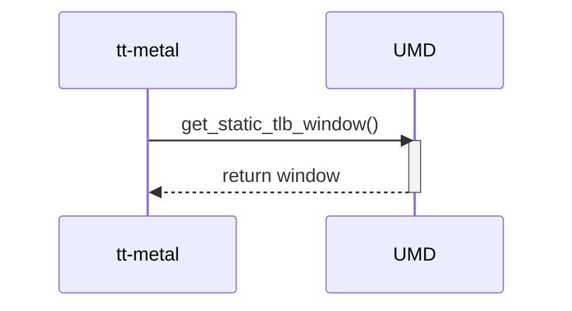

# TLB Configuration — Diagram Review

## Scope and provenance

Reviewed 2026-10-08 against approved scope version 2. This file is an additional presentation of the existing review, explicitly requested under `review/diagram/`; it adds no controlled input, source baseline, criterion or finding ID. The original [scope](../scope.md) and [scope lock](../scope.lock) remain unchanged. See the [diagram index](README.md).

- Target: `review-input/sad/umd-kmd-sad.md`, revision 0.1 (2026-09-15), SHA-256 `87d325a8d5cefbfa58e84b369bd8cb4f79e7fe81663203ae6165c954f3afc6ec`.
- UMD: `source/bos-umd`, `develop @ 86e0ab17209d7af8f741ac34c158ebbf71612ea4`.
- KMD: `source/bos-kmd`, `develop @ 12d235aeedb8aa55ede24927c9e09f88c8f278c4`.
- Controlled criteria: `review-input/checklist/sad-review-checklist.md` (CL) and `review-input/guideline/sad-writing-guideline.md` (GL), with hashes in the lock. SAD references below identify one-based lines in the target.

Evidence classes are `CONTROLLED RULE`, `DOCUMENT FACT`, `IMPLEMENTATION EVIDENCE`, `REVIEW OBSERVATION` and `OPEN ISSUE`. No assumption supplies intended architecture. Source evidence describes the pinned implementation only.

This review covers the TLB Configuration sequence at SAD:258–269, the getter contract at 162–180 and Overview/static-view context at 20–48. The [independent TLB interface review](../interfaces/05-tlb-configuration.md) contains the complete SAD-01 through SAD-09 checklist and detailed contract findings.

## Original diagram

Exact Mermaid fence from [SAD:260–269](/home/hoangb/BOS/sad-review/review-input/sad/umd-kmd-sad.md:260), reproduced without redesign:

## Applicable controlled rules

| Criterion | Controlled requirement and applicability |
|---|---|
| SAD-03, CL:19,31 | Assess component-level behavior for applicable modes, lifecycle, error/recovery and concurrency. An alternative dynamic description must be referenced and included in scope. The getter has a documented mapping-state precondition, but additional scenario applicability remains unresolved. |
| GL §3.2:238–241,249,253–257 | Runtime descriptions must support applicable verification; detail varies with architectural significance and verification needs. The simple getter cannot be required to have the same processing or diagram set as a transfer operation. |
| GL §3.2:243,245,259 | Activity Diagrams are recommended; additional description addresses applicable behavior. No missing Activity Diagram or absent KMD lifeline is automatically a violation. |
| SAD-01, CL:17; GL:135,146–151 | Component responsibilities and design scope must be identified. Relevant mapping ownership/lifetime cannot be inferred solely from a getter arrow. |
| SAD-02/SAD-05, CL:18,21; GL:217–224 | API names, input/output representation, conditions and results must support integration/testing and remain consistent. This governs the getter binding and related contract review. |

Sources: [checklist](/home/hoangb/BOS/sad-review/review-input/checklist/sad-review-checklist.md:17), [dynamic-view rules](/home/hoangb/BOS/sad-review/review-input/guideline/sad-writing-guideline.md:238), [interface rules](/home/hoangb/BOS/sad-review/review-input/guideline/sad-writing-guideline.md:217).

## Document facts and support

`DOCUMENT FACT` — The sequence depicts tt-metal calling UMD's `get_static_tlb_window()` and UMD returning `window` (SAD:262–268). The method name agrees with the interface operation at 164 and the response agrees with the window output at 177. The contract explicitly requires an existing valid static mapping at 179. A normal request/return flow is present.

`DOCUMENT FACT` — The target is described as “Device Address/ TLB Identifier” at 170 and the result as “TLB Window” at 177. The document does not establish whether this is copied metadata or a live access handle, who maintains the mapping or how long the result stays valid. Applicable invalidation, failure and concurrent-use scenarios are not established.

`REVIEW OBSERVATION` — A retrieval operation may run entirely in userspace once supporting resources exist. The static UMD→KMD dependency does not require a KMD call in every dynamic scenario. No formal dynamic violation is inferred from the short sequence or absent KMD participant.

## Consistency across views and the UMD/KMD boundary

| View | Direct evidence | Review assessment |
|---|---|---|
| Overview, SAD:24–28 | UMD relies on KMD device nodes, ioctls and BAR mappings. | Compatible with an earlier setup dependency and a later userspace getter. The getter's resource owner/lifetime remains unspecified. |
| Static, SAD:37–47 | Separate UMD and KMD nodes; tt-metal → UMD TLB Configuration edge. | Separate component nodes exist; their design scopes/responsibilities remain incomplete (SAD-F-001). Static dependency does not prescribe a per-getter KMD exchange. |
| Interface, SAD:164–179 | Retrieval description, address-or-ID target, window result and existing-mapping precondition; Output label is `write_to_device()`. | Operation/result concept agrees with the sequence. Representation/lifetime gaps are SAD-F-501; the wrong output label is SAD-F-503, a related contract error. |
| Dynamic, SAD:265–267 | Getter request and returned window only. | Simple success flow is supported. State/lifetime and applicable failure coverage are unestablished (TLB-DYNAMIC). |
| Title versus operation, SAD:162,165,258 | TLB Configuration heading; description says retrieval. | TLB-TERM is a terminology/scope observation. Retrieval is not evidence that the call changes hardware configuration. |

## UMD implementation evidence

`IMPLEMENTATION EVIDENCE` — Evidence is from the pinned UMD baseline. The [UMD evidence ledger](../evidence/umd-code-evidence.md) preserves bounds and ambiguity.

| Evidence | File / symbol / lines | Observed behavior and limit |
|---|---|---|
| UMD-EV-009 | Tracked C/C++ exact-name search for `get_static_tlb_window` | No exact occurrence in tracked `*.cpp`, `*.cc`, `*.c`, `*.h`, `*.hpp`. No claim is made about outside wrappers, generated/deployed binaries or firmware. |
| UMD-EV-009 | `source/bos-umd/device/blackholeplus/cluster.h:389–399`; `cluster.cpp:376–377`, `get_static_tlb_writer` | Nearby API takes chip/core and returns `tt::Writer`. Header comments require a configured, unchanged mapping and a Cluster that outlives the writer. These are implementation facts, not controlled requirements for the SAD getter. |
| UMD-EV-009 | `source/bos-umd/device/blackholeplus/tlb_manager.cpp:22–49,60–111`, `TLBManager::get_static_tlb_writer`; `local_chip.cpp:75–94` | Core maps are initialized; the getter checks a mapped core and BAR2, then constructs a Writer from derived address/size. Inspected dynamic setters throw. The getter does not invoke KMD CONFIGURE_TLB. Its result is not proven equivalent to the SAD TLB Window. |
| UMD-EV-004 | `source/bos-umd/device/blackholeplus/pci_device.cpp:193–324`, `PCIDevice` construction/destruction | Establishes and releases BAR mappings. Broad existing-mapping support is present, without proving intended getter lifetime or invalidation behavior. |

Selected source: [writer contract](/home/hoangb/BOS/sad-review/source/bos-umd/device/blackholeplus/cluster.h:389), [writer getter](/home/hoangb/BOS/sad-review/source/bos-umd/device/blackholeplus/tlb_manager.cpp:77).

## KMD implementation evidence

`IMPLEMENTATION EVIDENCE` — KMD supporting resources are distinguished from direct participation in the getter. See the [KMD evidence ledger](../evidence/kmd-code-evidence.md).

| Evidence | File / symbol / lines | Observed behavior and limit |
|---|---|---|
| KMD-EV-004/005 | `source/bos-kmd/memory.c:372–449,1186–1237`, mapping query and `bos_mmap` | Exposes mapping resources and establishes VMAs. This supports setup, not a required kernel transaction for every getter. |
| KMD-EV-006 | `source/bos-kmd/ioctl.h:238–295`; `memory.c:906–1004,1065–1114,1221–1227`, `ioctl_allocate_tlb`, `ioctl_free_tlb`, `ioctl_configure_tlb` and VMA callbacks | Separate allocated TLB objects have IDs, mmap offsets, per-file ownership and mapping-reference checks. These are not established as the SAD static window or the UMD core-map Writer. |
| KMD-EV-013 | `source/bos-kmd/Makefile:13–14`; `enumerate.c:119–127`; `blackhole.c:804–838,992–1014` | Default `BLACKHOLEPLUS` skips the inspected initialization block while related callbacks remain. Supported optional callbacks require an owner decision; this is not a reproduced fault or proven getter dependency. |

Selected source: [kernel TLB allocation](/home/hoangb/BOS/sad-review/source/bos-kmd/memory.c:906), [mmap dispatcher](/home/hoangb/BOS/sad-review/source/bos-kmd/memory.c:1186).

## Applicable assessment

These are diagram-focused assessments. Full interface checklist results remain in the linked interface review.

| Check | Result | Evidence basis |
|---|---|---|
| Normal getter request/response | Pass, bounded | Operation name and returned-window concept agree with the interface table; an existing mapping is explicitly required. |
| SAD-03 applicable verification coverage | Fail — missing-evidence acceptance | TLB-DYNAMIC: state/lifetime and applicable failure coverage are unestablished. This is not a formal dynamic-view violation. |
| Need for a KMD participant in this getter | No defect established | Existing setup resources can support a userspace-only getter; no controlled rule or demonstrated interaction mandates a kernel call here. |
| Exact SAD-to-UMD operation correspondence | Unresolved implementation drift | SAD-F-504: no exact searched symbol; chip/core Writer analogue differs from address/TLB-ID Window contract. |
| Mapping ownership/lifetime | Missing evidence | TLB-OWNER and SAD-F-501 capture the unresolved contract; kernel allocated TLB objects and UMD core maps are not assumed interchangeable. |
| SAD-04 bidirectional requirements traceability | Blocked | Controlled SRS is not supplied. |

## Existing findings and open issues

### TLB-DYNAMIC — Applicable dynamic coverage is not established

- **Classification:** Missing evidence; no formal dynamic-view finding and no severity.
- **Controlled assessment basis:** SAD-03, CL:19,31; GL:238,249,253–257. Coverage must follow applicable behavior and verification needs.
- **Direct evidence:** SAD:265–267 supplies a normal getter exchange; SAD:179 requires a valid existing mapping. Mapping-state/lifetime dependencies and applicable failure coverage are not established in SAD:162–180,258–269.
- **Impact:** Review cannot close applicable state/lifetime and failure verification coverage for the getter, or determine whether more detail is necessary.
- **Minimal owner action:** Establish the intended result and resource-lifetime model, then identify applicable scenarios or a supported rationale for sufficient coverage. No Activity Diagram, algorithm or KMD transaction is imposed.
- **Traceability:** Requirement / VC not supplied; SAD TLB getter sequence; UMD-EV-004/009 and KMD-EV-004/005/006 provide limited support.

### SAD-F-504 — Exact static-window getter correspondence remains unresolved

- **Classification:** Implementation drift; SAD-02 comparison context, not a formal dynamic-view violation.
- **Controlled comparison basis:** CL:18; GL:217,224.
- **Direct evidence:** SAD:164,170,177,265 names `get_static_tlb_window()` with address/TLB identifier and TLB Window. The exact name is absent from the bounded search; `get_static_tlb_writer(chip_id_t, CoreCoord)` returns `tt::Writer` (UMD-EV-009).
- **Impact:** The documented interaction has no verified implementation entry-point/result binding.
- **Minimal owner correction:** Confirm the intended API, target/result representation and lifetime, then reconcile the artifacts or document a valid correspondence. Neither Writer nor KMD allocation/configuration is automatically the intended operation.

SAD-F-001, SAD-F-501 and SAD-F-503 remain related component/contract records in the [interface review](../interfaces/05-tlb-configuration.md). The wrong Output label is not recast as a new sequence defect, and TLB-TERM remains a terminology observation.

## Decisions and traceability

| Existing decision | Required owner evidence |
|---|---|
| TLB-BINDING / TLB-VARIANT | Intended API/build; address-versus-ID target; metadata-versus-live-handle result and any explicit source correspondence. |
| TLB-OWNER | Who establishes/owns the mapping; valid result lifetime; intended static/dynamic facilities and applicable invalidation behavior. |
| TLB-DYNAMIC | Relevant state, error, lifecycle and concurrent-use coverage or a supported sufficiency rationale. |
| TLB-TERM | Whether the heading denotes a broader category or should distinguish retrieval; no reconfiguration behavior is presumed. |
| TLB-REQ | Controlled forward allocation and reverse requirement justification remain Blocked. |

SAD-to-code mapping is **Missing** for exact getter identity and **Partial** for existing-mapping support and a userspace-only retrieval pattern. Reverse mapping from chip/core Writer and kernel allocated TLB facilities to the SAD target/result remains unproven. [Traceability evidence](../evidence/traceability.md) records the limitations. Source preconditions are not substituted for requirements.

## Limitations and final diagram result

Read-only static inspection; no build, runtime getter, invalidation, concurrency, hardware translation or deployed ABI validation. Inspected source defaults do not establish intended deployment. Optional kernel callback support is unresolved, and neither hardware specifications nor external wrappers are supplied. SAD-09 remains N/A for external PM/planning assessment within the approved scope, without claiming no planning impact.

**Final diagram assessment: Fail for evidence acceptance under SAD-03; no formal dynamic-view violation established. Requirements coverage: Blocked.** The normal getter flow is supported, while applicable state/lifetime coverage and exact implementation binding remain unresolved. The separate full-interface result is Fail for its existing component/contract and shared-analysis findings. The original diagram and protected inputs were not changed.
